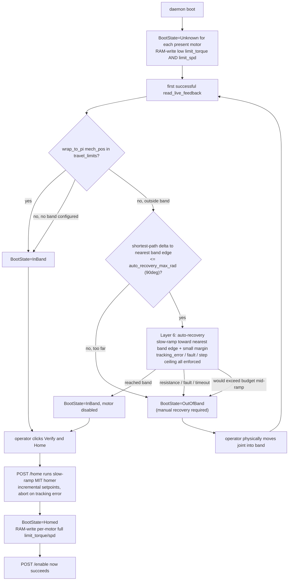
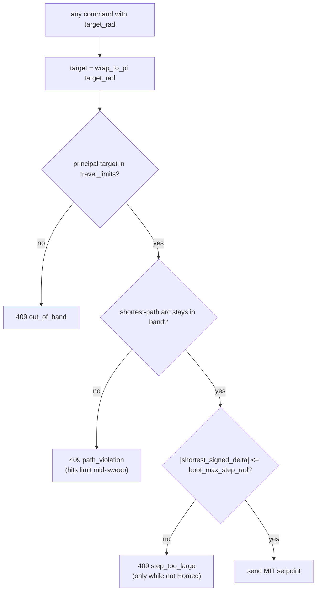
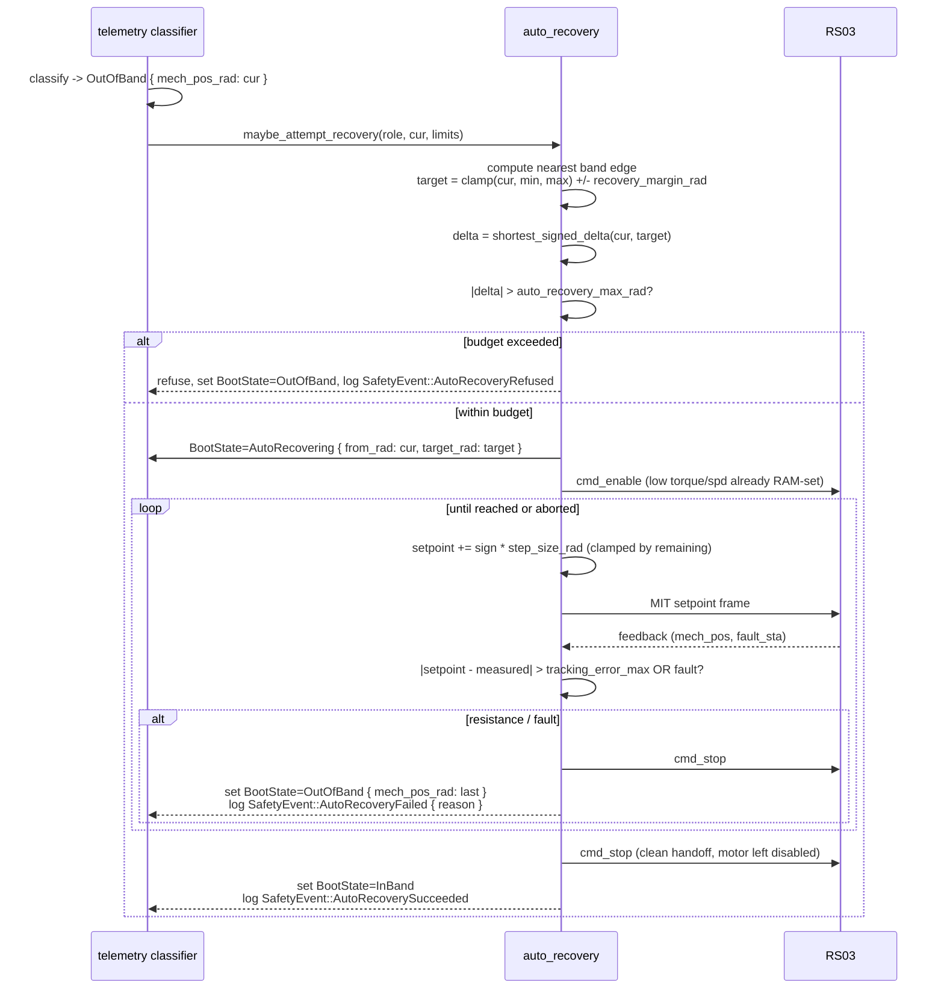
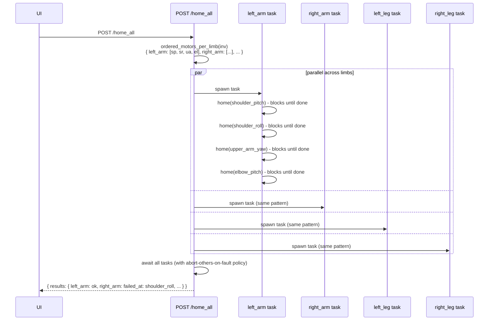
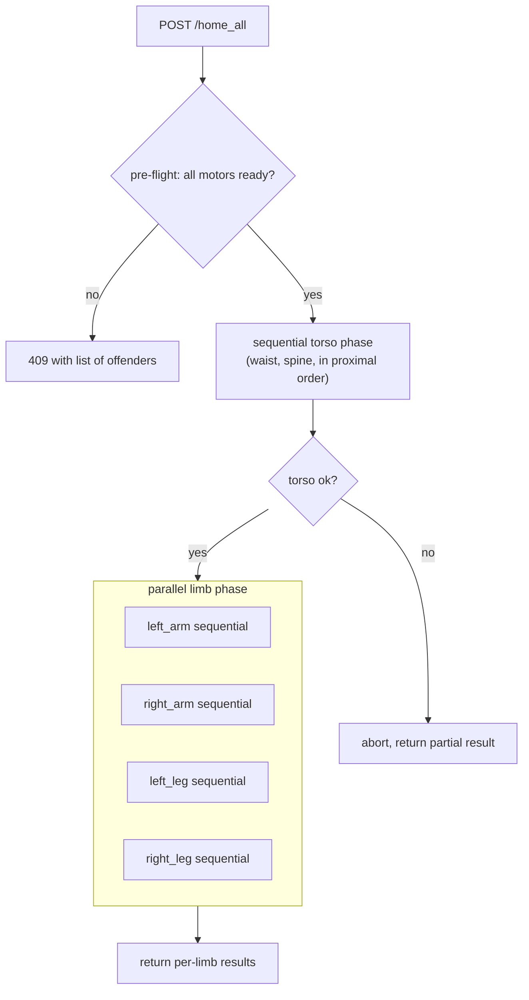

> **Superseded (2026-04):** This document describes the original boot-time travel-band gate, including **Layer 6 auto-recovery** (`BootState::AutoRecovering`). Layer 6 was **removed** from `rudydae`; out-of-band joints require **manual** recovery, and commissioned actuators rely on the **commissioned-zero boot orchestrator** (`AutoHoming` → `Homed`) plus inventory-backed `commissioned_zero_offset`. Do not treat the todos below as a current implementation checklist. **Canonical follow-on design:** [quick-home_commissioned_zero_boot.plan.md](quick-home_commissioned_zero_boot.plan.md). Wire-protocol and band-gating rationale remain useful; auto-recovery and `auto_recovery_*` config are obsolete.

## Boot-time travel-band gate + reduced-torque first-boot

### The disaster this prevents

The RS03 has a 14-bit single-turn absolute encoder on the **rotor** behind a **9:1 gearbox**. The firmware maintains the multi-turn count in NVM, but if the joint is moved by hand more than ~40deg on the output while powered off, the rotor crosses a single-turn sector boundary and the firmware loses track. On boot, `mech_pos_rad` reads a value that's wrong by +/-2*pi/9 ~= +/-40deg (or more, if multiple sectors were crossed).

The known failure mode: motor reports +20deg (actually +20deg + 360deg). Operator commands "go to 0deg." Firmware picks the path it thinks is shortest, which is now -340deg, and the motor rips out wiring before it stops. **Travel-band checks alone do not prevent this** because the firmware passes the band check (it thinks +20deg is in [-60deg, +60deg]).

The structural fix: never let the firmware pick the path. All motion commands are computed in **principal-angle (wrap-to-pi) space**, dispatched as **incremental MIT setpoints capped per-step**, with **velocity and torque both clamped low** until homed.

### Top-level safety invariant

**If `travel_limits` is set on a motor, any command that would result in motion outside `[min_rad, max_rad]` is rejected at the earliest possible layer, in all states, on all command paths, regardless of `BootState` or `enabled` status.** The daemon never "tries and aborts mid-motion" for a band violation; it refuses the request before any CAN frame leaves the host.

This invariant is enforced by a single chokepoint (`enforce_position_with_path`) that every command-producing endpoint must call before dispatching to the motor.

**One narrow exception, defined precisely:** the boot-time auto-recovery routine (Layer 6 below) is *allowed* to command motion when the motor is currently outside the band, provided (a) the target is inside the band, (b) the shortest-path distance to recovery is below `auto_recovery_max_rad` (default 90deg), (c) torque and speed are clamped to commissioning defaults, and (d) the routine aborts immediately on any tracking error or fault. This is the only code path that may produce motion while position is out of band, and it is hard-coded to one motor at a time, never invoked except by the daemon at boot.

### Layered defenses (all required, all in this PR)

| Layer | Defense | Catches | When active |
|-------|---------|---------|-------------|
| 0 | **Principal-angle travel-band check on EVERY command path** | Any commanded position outside the band, in any state | Always, when `travel_limits` is set (one narrow exception: Layer 6) |
| 1 | Swept-arc band check (path stays in band, not just endpoints) | Wrap-around shortcuts that pass through forbidden zones | Always, when `travel_limits` is set |
| 2 | Per-step motion ceiling (`|delta| <= boot_max_step_rad`) | Any large jump regardless of band status | While `BootState != Homed` |
| 3 | Slow-ramp MIT-mode homer with abort-on-tracking-error | Operator-initiated autonomous moves bounded by physics | During operator-initiated `home` |
| 4 | RAM-write low `limit_torque` AND `limit_spd` at boot | Worst-case "the daemon got it all wrong" | Until `home` succeeds |
| 5 | `BootState` enable gate (refuse enable until Homed) | Operator skipping the homing ritual | Until `home` succeeds |
| 6 | **Boot-time auto-recovery with capped angular budget** | Joints that boot up slightly outside band from settling/drift | Once at startup, only if `OutOfBand` AND shortest-path distance <= `auto_recovery_max_rad` |

Layer 0 is the load-bearing one for the stated invariant. Layers 1-6 are defense in depth on top of it. Layer 6 is the only one allowed to command motion while position is out of band, and only under tightly bounded conditions.

### State model

Add a per-motor in-memory `BootState` enum on `AppState` (separate from the `verified` / `present` flags in `inventory.yaml`, because boot state is **per-power-cycle**, not persisted):

```rust
pub enum BootState {
    Unknown,                 // no telemetry yet, or read failed
    OutOfBand { mech_pos_rad: f32, min_rad: f32, max_rad: f32 },
    AutoRecovering {         // Layer 6 routine is currently moving the motor
        from_rad: f32,
        target_rad: f32,
        progress_rad: f32,   // updated per tick for UI progress display
    },
    InBand,                  // position confirmed inside band, NOT yet homed
    Homed,                   // operator clicked Verify & Home; full torque restored
}
```

`Homed` is the only state in which `enable` is allowed (Check B). `InBand` and `AutoRecovering` block enable. `AutoRecovering` additionally blocks **all** other command paths (jog, params writes that affect motion, bench tests) — the daemon is driving the motor and won't share control. The transition `OutOfBand -> AutoRecovering` only happens once per motor per boot via Layer 6; manual operator intervention is the only way out of `OutOfBand` if Layer 6 refuses or fails.

### Boot flow



Note on the design: auto-recovery (Layer 6) only brings the motor back **into** the band. It does **not** count as homing. The operator still has to click Verify & Home afterward to transition to `Homed` and unlock full torque/speed. This keeps the human-in-the-loop step where it belongs (acknowledging "yes the joint is where it claims to be") while removing the trivial "settled 5deg outside the band overnight" annoyance.

### Per-command motion gate (applies to every command path while not Homed)



### File-by-file changes

**1. Motion helpers (foundational)** — new [crates/rudydae/src/can/motion.rs](crates/rudydae/src/can/motion.rs)

The atomic safety primitive. Everything else depends on this being correct, so it lands first with thorough unit tests.

```rust
/// Reduce an angle to its principal value in [-pi, +pi].
pub fn wrap_to_pi(rad: f32) -> f32 {
    let two_pi = std::f32::consts::TAU;
    let mut x = rad % two_pi;
    if x > std::f32::consts::PI { x -= two_pi; }
    if x < -std::f32::consts::PI { x += two_pi; }
    x
}

/// Shortest signed angular distance from `current` to `target`,
/// in [-pi, +pi]. Both inputs are first reduced to principal angles.
pub fn shortest_signed_delta(current_rad: f32, target_rad: f32) -> f32 {
    wrap_to_pi(wrap_to_pi(target_rad) - wrap_to_pi(current_rad))
}
```

Unit tests: identity, +/-pi boundary, +359 -> +1 wraps to +2 not -358, multi-revolution inputs collapse correctly, NaN/inf saturate to a safe error. **These tests are non-negotiable; the rest of the system trusts this module to be bulletproof.**

This is safe for our joints because we confirmed all output ranges are strictly less than 360deg (cable-bound), so the principal-angle representation is unambiguous within the joint's physical range.

**2. State container** — [crates/rudydae/src/state.rs](crates/rudydae/src/state.rs)

Add `boot_state: RwLock<HashMap<String, BootState>>` to `AppState`. Initialize every present motor to `Unknown` in `AppState::new`. Define `BootState` in a new sibling module `boot_state.rs` next to `travel.rs`.

Also add a config knob: `safety.boot_max_step_rad: f32` (default `0.087` ~= 5deg) on the existing config struct.

**3. Principal-angle travel-band check (the chokepoint)** — [crates/rudydae/src/can/travel.rs](crates/rudydae/src/can/travel.rs)

Today's `enforce_position` compares the raw `target_rad` to `min_rad`/`max_rad`. Replace with `enforce_position_with_path` that operates on principal angles AND checks the swept arc:

```rust
pub fn enforce_position_with_path(
    state: &SharedState,
    role: &str,
    current_rad: f32,
    target_rad: f32,
) -> Result<BandCheck> {
    let limits = /* ...load from inventory... */;
    let Some(limits) = limits else {
        return Ok(BandCheck::NoLimit);
    };
    let cur_p = wrap_to_pi(current_rad);
    let tgt_p = wrap_to_pi(target_rad);

    // 1) target endpoint must be in band
    if tgt_p < limits.min_rad || tgt_p > limits.max_rad {
        let _ = state.safety_event_tx.send(SafetyEvent::TravelLimitViolation { /* ... */ });
        return Ok(BandCheck::OutOfBand { /* ... */ });
    }
    // 2) current position must be in band (so the shortest-path arc stays in band).
    //    For our <360deg cable-bound joints with [min,max] inside one revolution,
    //    if both endpoints are in [min,max] the entire shortest-path arc is too.
    if cur_p < limits.min_rad || cur_p > limits.max_rad {
        let _ = state.safety_event_tx.send(SafetyEvent::TravelLimitViolation { /* ... */ });
        return Ok(BandCheck::PathViolation { /* ... */ });
    }
    Ok(BandCheck::InBand { delta_rad: shortest_signed_delta(cur_p, tgt_p) })
}
```

`BandCheck` gains a `PathViolation` variant. **Every endpoint that can produce motion must call this function before dispatching anything to the motor.** Specifically:

| Endpoint | File | Today's behavior | After this PR |
|----------|------|------------------|---------------|
| `POST /motors/:role/jog` | [crates/rudydae/src/api/jog.rs](crates/rudydae/src/api/jog.rs) lines 123-148 | calls `enforce_position` (endpoints only) | calls `enforce_position_with_path` |
| `POST /motors/:role/enable` | [crates/rudydae/src/api/control.rs](crates/rudydae/src/api/control.rs) | no band check | calls `enforce_position_with_path(current, current)` to verify motor is currently in band; refuses 409 if not |
| `POST /motors/:role/home` | new [crates/rudydae/src/api/home.rs](crates/rudydae/src/api/home.rs) | n/a | calls `enforce_position_with_path` for the target AND on every tick during the ramp |
| `POST /motors/:role/tests/:name` | bench tests | varies per test | bench tests that command position must call `enforce_position_with_path`; refuses to start if not in band |
| `POST /motors/:role/set_zero` | [crates/rudydae/src/api/control.rs](crates/rudydae/src/api/control.rs) | no band check | not gated (set_zero changes the offset, not the position; but it DOES reset BootState=Unknown so subsequent commands re-classify) |
| `PUT /motors/:role/params/:name` | [crates/rudydae/src/api/params.rs](crates/rudydae/src/api/params.rs) | range-checks param value only | param writes don't directly cause motion, but a `run_mode` change to operation_mit while not Homed should be refused (separate hardening) |

Add a small helper to make this hard to forget:

```rust
// Call this at the top of any handler that will command motion.
pub fn require_in_band_for_target(state, role, target_rad) -> Result<(), ApiErr>
```

Returns a 409 ApiError directly if the band is set and the check fails. This becomes the canonical pattern; reviewers can grep for it to verify every motion endpoint uses it.

**4. Telemetry classifier** — [crates/rudydae/src/telemetry.rs](crates/rudydae/src/telemetry.rs) and/or [crates/rudydae/src/can/linux.rs](crates/rudydae/src/can/linux.rs)

After each successful `read_live_feedback`, call `boot_state::classify(state, role, mech_pos_rad)` that:
- wraps the position to principal,
- looks up `travel_limits` from live inventory,
- if no band, transitions `Unknown -> InBand` (degenerate),
- if band and principal `mech_pos` is inside, transitions `Unknown|OutOfBand -> InBand`,
- if outside, transitions `Unknown|InBand -> OutOfBand` with `{ mech_pos_rad: principal, min_rad, max_rad }`,
- never demotes `Homed` (only `set_zero` or daemon restart does).

**5. Reduced torque AND speed at boot** — new helper in [crates/rudydae/src/can/linux.rs](crates/rudydae/src/can/linux.rs)

At telemetry startup, for each present motor RAM-write **both**:
- `limit_torque` (0x700B) = `spec.commissioning_defaults.limit_torque_nm` (5.0 Nm),
- `limit_spd` (0x7017) = `spec.commissioning_defaults.limit_spd_rad_s` (2.0 rad/s).

RAM-only, no `save_params`. Both are needed: torque alone allows fast unintended motion; speed alone allows high stall force. The combination keeps the worst case to "slow and weak."

If either write fails, log and leave `BootState=Unknown` (refusing to enable is the safer fallback than enabling with unknown limits).

**6. Per-step API gate (Defense 2)** — [crates/rudydae/src/api/jog.rs](crates/rudydae/src/api/jog.rs) and any future move-to handlers

While `BootState != Homed`, after the band check, also enforce:

```rust
if boot_state != Homed
    && shortest_signed_delta(current, target).abs() > cfg.safety.boot_max_step_rad
{
    return Err(409 step_too_large { delta_rad, max_rad });
}
```

This is the safety net. Even if a buggy client tries to command a 340deg jump while not Homed, the daemon refuses. The same check inside the homer's loop guarantees the homer itself can't generate a large step.

**6b. Boot-time auto-recovery (Layer 6, the narrow exception)** — new [crates/rudydae/src/can/auto_recovery.rs](crates/rudydae/src/can/auto_recovery.rs), invoked from [crates/rudydae/src/telemetry.rs](crates/rudydae/src/telemetry.rs)

Triggered by the classifier in step 4 when a motor's first telemetry read produces `BootState=OutOfBand`. The classifier transitions to a new intermediate state `BootState::AutoRecovering { from_rad, target_rad }` and spawns this routine in a `spawn_blocking` task.



Key parameters (all on `safety` config, all overridable):
- `auto_recovery_max_rad: f32` (default `1.5708` = 90deg) - if the shortest-path delta to the nearest band edge exceeds this, refuse auto-recovery and require manual.
- `recovery_margin_rad: f32` (default `0.087` = 5deg) - target lands this far INSIDE the band edge, not exactly on it, to avoid bouncing on the boundary.
- All other parameters (`step_size_rad`, `tick_interval_ms`, `tracking_error_max_rad`, `target_tolerance_rad`, `timeout_ms`) reuse the same defaults as the operator-initiated homer in step 7. Same physics, same thresholds; consistent behavior makes both easier to reason about.

**Hard rules baked into the implementation:**

1. **Single attempt per boot.** The routine runs at most once per motor per daemon lifetime. If it fails, it does not retry. Operator must explicitly intervene (manual move + restart, or future "retry recovery" endpoint).
2. **Single motor at a time.** Auto-recovery is sequential across motors. Two motors that both boot up out of band recover one after the other, not in parallel. Cuts the worst-case "everything moves at once" scenario.
3. **Motor is left disabled on success.** Auto-recovery brings position back into band, calls `cmd_stop`, and transitions to `BootState=InBand`. The operator still has to do the Verify & Home ritual to enable. Auto-recovery is *not* a substitute for homing; it's a courtesy that prevents the operator from having to physically push the joint.
4. **Per-step ceiling and band check still apply within the routine.** Each MIT setpoint frame goes through the same `enforce_position_with_path` check as any other motion — the routine's "exception" to Layer 0 is only that `current` may be outside the band; the *target* and the *swept arc* must end up inside. Specifically: each step's setpoint must be closer to the band than the previous step (monotonic progress toward recovery), and once the setpoint crosses into the band the same path-stays-in-band check applies for the remaining motion.
5. **Audit events.** `SafetyEvent::AutoRecoveryAttempted { role, from_rad, target_rad, delta_rad }` at start, `AutoRecoverySucceeded { role, final_pos_rad, ticks }` or `AutoRecoveryFailed { role, reason, last_pos_rad }` at end, both pushed onto the existing safety event ring for the audit log.
6. **Disabled by global config flag.** `safety.auto_recovery_enabled: bool` (default `true`) lets you disable Layer 6 entirely without code changes. Useful for paranoid environments or when bringing up a new joint.

**7. Slow-ramp homer: `POST /api/motors/:role/home`** — new [crates/rudydae/src/api/home.rs](crates/rudydae/src/api/home.rs)

```mermaid
sequenceDiagram
    participant UI
    participant API as POST /home
    participant Daemon
    participant Motor as RS03

    UI->>API: { target_rad: 0.0 }
    API->>API: BootState == InBand?
    API->>Motor: read mech_pos (one-shot)
    API->>API: wrap_to_pi -> in band?
    API->>Motor: cmd_enable (MIT mode, low torque/spd already RAM-set)
    loop until reached or aborted
        API->>API: setpoint += sign * step_size_rad (clamped by remaining)
        API->>API: assert |setpoint - measured| < tracking_error_max
        API->>Motor: MIT setpoint frame (pos=setpoint, vel=0, kp/kd low, tff=0)
        Motor-->>API: feedback (mech_pos, fault_sta)
        API->>API: tick (e.g. 50ms)
    end
    API->>Motor: cmd_stop (clean handoff)
    API->>Daemon: BootState = Homed; RAM-write full torque/spd
    API-->>UI: { ok, samples: [...] }
```

Key parameters (all on `safety` config, all overridable):
- `step_size_rad: f32` (default 0.02 = ~1.1deg per tick)
- `tick_interval_ms: u32` (default 50, so ~22deg/s effective)
- `tracking_error_max_rad: f32` (default 0.05 ~= 2.9deg) - if `|setpoint - measured| > this`, the motor is bound up; abort
- `target_tolerance_rad: f32` (default 0.005 ~= 0.3deg) - reached when `|target - measured| < this`
- `timeout_ms: u32` (default 30000)

Abort conditions (each one calls `cmd_stop` and returns 409):
- tracking error exceeds limit (motor stalled / blocked),
- `fault_sta != 0`,
- `mech_pos` would leave the band (path check on every tick using `enforce_position_with_path`),
- timeout exceeded,
- operator E-stop fires.

On success:
- transition `BootState = Homed`,
- RAM-write the per-motor full `limit_torque` (from `inventory.motors[role].limits_written.limit_torque_nm`; refuse with 409 `limits_not_set` if null),
- RAM-write the per-motor full `limit_spd` (from `limits_written.limit_spd_rad_s`),
- emit `SafetyEvent::Homed { role, samples_count }`,
- return `{ ok: true, final_pos_rad, ticks }`.

Routed in [crates/rudydae/src/api/mod.rs](crates/rudydae/src/api/mod.rs):

```rust
.route("/motors/:role/home", post(home::home))
```

Same control-lock requirement as `jog` (it's a long-running motion command).

**8. Enable gate (TWO checks, both required)** — [crates/rudydae/src/api/control.rs](crates/rudydae/src/api/control.rs)

After the existing `require_verified` check, in this order:

**Check A: position-vs-band (the hard invariant).** Read the latest cached `mech_pos_rad`. Call `require_in_band_for_target(state, role, mech_pos_rad)`. If the motor's current position is outside the configured band, refuse with **409** `out_of_band`. **This check fires regardless of `BootState`** - even if the operator manually fiddled with state, even if telemetry is stale, even after a `Homed` transition, if `travel_limits` is set and the motor is not within them right now, enable is refused.

**Check B: BootState ritual.** Inspect `BootState`:
- `Homed` -> proceed,
- `InBand` -> **409** `not_homed` with hint "POST /motors/:role/home first",
- `OutOfBand` -> **409** `out_of_band` (redundant with Check A but more specific message),
- `Unknown` -> **409** `not_ready`.

The two checks are belt-and-suspenders on purpose: Check A is the inviolable physics rule ("position must be in band"), Check B is the operational discipline ("operator must have explicitly homed"). Either one failing blocks enable.

Errors use the existing `ApiError` envelope (already keyed by `error` discriminator, matching the frontend's `errorCode()` switch in [link/src/components/actuator/actuator-travel-tab.tsx](link/src/components/actuator/actuator-travel-tab.tsx) line 317).

**9. `MotorSummary` exposure** — [crates/rudydae/src/types.rs](crates/rudydae/src/types.rs) and [crates/rudydae/src/api/motors.rs](crates/rudydae/src/api/motors.rs)

Extend `MotorSummary` with `boot_state: BootStateView` where `BootStateView` is a `ts_rs`-derived enum mirroring the Rust enum (carrying the `mech_pos_rad`/`min_rad`/`max_rad` for `OutOfBand` so the UI can display "X.X deg outside [Y.Y, Z.Z]" without a second roundtrip). Populated in `summary_for(motor, latest)` by reading from `state.boot_state`. Auto-regenerated TS lands in [link/src/lib/types/MotorSummary.ts](link/src/lib/types/MotorSummary.ts) via the existing `ts_rs` workflow.

**10. UI** — [link/src/components/actuator/actuator-travel-tab.tsx](link/src/components/actuator/actuator-travel-tab.tsx) and [link/src/routes/_authed.actuators.$role.tsx](link/src/routes/_authed.actuators.$role.tsx)

- Header badge (next to the existing `needs travel limits` badge at line 177 of `_authed.actuators.$role.tsx`):
  - `OutOfBand` -> red badge "out of band: X.X deg, move into [min, max]" (auto-recovery refused or failed; manual intervention required),
  - `AutoRecovering` -> amber pulsing badge "auto-recovering: X.X / Y.Y deg" with a small abort button (calls `/api/estop`),
  - `Unknown` -> grey badge "no telemetry",
  - `InBand` -> amber badge "needs verify & home",
  - `Homed` -> green badge "homed" (or hide).
- Travel tab gets a "Verify & Home" card above the existing limits card:
  - shows live position vs band (reuse `BandStrip`),
  - shows the planned slow-ramp parameters ("will move ~22 deg/s, capped at low torque/speed, abort on stall") so the operator knows what's about to happen,
  - target input (default 0.0 deg, clamped to band),
  - "Verify & Home" button (disabled unless `boot_state === "InBand"` and `limits_written.limit_torque_nm != null`),
  - while running, shows live `final_pos_rad` progress and an "Abort" button that issues `POST /api/estop`,
  - on success, invalidates `["motors"]` cache.
- New API method on `link/src/lib/api.ts`: `homeMotor(role, target_rad?)`.

**11. Tests** — [crates/rudydae/tests/api_contract.rs](crates/rudydae/tests/api_contract.rs) and new unit tests on `motion.rs`

Unit tests on `motion.rs` (must pass before anything else):
- `wrap_to_pi_handles_principal_range` (input in [-pi, +pi] returns unchanged)
- `wrap_to_pi_collapses_multi_revolution` (3*pi -> +pi, -3*pi -> -pi, +359deg -> -1deg)
- `shortest_signed_delta_picks_shorter` (current=+170deg, target=-170deg -> +20deg, NOT -340deg) **[the disaster scenario test]**
- `shortest_signed_delta_at_pi_boundary` (current=0, target=+pi -> +pi or -pi, deterministic tiebreak)
- `wrap_to_pi_rejects_nan_inf`

Contract tests (the band-check coverage matrix is the most important set):

**Top-level invariant tests (one per command path):**
- `jog_target_outside_band_is_forbidden`: jog command projecting outside band returns 409 `travel_limit_violation` regardless of BootState.
- `enable_position_outside_band_is_forbidden`: motor reporting outside band can't be enabled even if `BootState=Homed`.
- `home_target_outside_band_is_forbidden`: home with target outside band returns 409 `out_of_band` immediately.
- `home_aborts_if_motor_drifts_outside_band_mid_ramp`: simulate position drifting outside band during the ramp; homer aborts, motor stops, 409 returned.
- `bench_test_outside_band_is_forbidden`: bench tests that command position refuse to start when motor is outside band.

**BootState ritual tests:**
- `enable_not_homed_is_forbidden`: in-band but not homed, expect 409 `not_homed`.
- `home_succeeds_then_enable_succeeds`: homing transitions to `Homed`, enable returns 200.
- `home_without_limits_written_torque_is_forbidden`: 409 `limits_not_set`.
- `set_zero_resets_boot_state_to_unknown`: after set_zero, `BootState=Unknown` and enable is refused until re-classification.

**Per-step ceiling tests:**
- `jog_step_too_large_when_not_homed_is_forbidden`: jog command projecting >5deg delta returns 409 `step_too_large` while `BootState=InBand`.
- `jog_step_unbounded_when_homed`: same jog command after homing succeeds (modulo travel band, which still applies).
- `home_internal_step_never_exceeds_ceiling`: instrumented homer test verifies no MIT setpoint frame ever advances the setpoint by more than `step_size_rad`.

**Defense-in-depth crossover:**
- `enable_in_band_but_unknown_state_is_forbidden`: position is in band but `BootState=Unknown` (no telemetry yet). Check A passes, Check B fails. Expect 409 `not_ready`.
- `enable_homed_but_drifted_outside_band_is_forbidden`: motor was Homed, then drifted (e.g. external force) outside the band. Even though state says Homed, current position is outside. Expect 409 `out_of_band`. (Belt-and-suspenders working as intended.)
- `home_aborts_on_tracking_error`: simulate fault_sta or stalled feedback in mock CAN, expect homer to abort and return 409.

**Auto-recovery (Layer 6) tests:**
- `auto_recovery_within_budget_succeeds`: motor boots up 30deg outside band, classifier triggers auto-recovery, mock CAN simulates clean motion, motor ends at band edge + margin, `BootState=InBand`, motor is left disabled.
- `auto_recovery_exceeding_budget_is_refused`: motor boots up 120deg outside band (> 90deg budget), Layer 6 refuses without sending any motion frame, `BootState=OutOfBand`, audit event `AutoRecoveryRefused` emitted.
- `auto_recovery_aborts_on_resistance`: simulate tracking error mid-recovery, expect immediate `cmd_stop`, `BootState=OutOfBand` with last position, audit event `AutoRecoveryFailed { reason: "tracking_error" }`.
- `auto_recovery_aborts_on_fault`: simulate non-zero fault_sta mid-recovery, same as above with `reason: "fault"`.
- `auto_recovery_runs_at_most_once_per_motor_per_boot`: after a failed recovery, manually push state back to OutOfBand and verify the routine does NOT re-trigger.
- `auto_recovery_disabled_by_config`: with `safety.auto_recovery_enabled: false`, OutOfBand motor stays OutOfBand at boot, no motion attempted.
- `auto_recovery_left_motor_disabled_does_not_imply_homed`: after successful recovery, `enable` still returns 409 `not_homed` (the operator must still do the Verify & Home ritual).
- `auto_recovery_per_step_ceiling_is_enforced`: instrumented mock CAN test verifies no MIT setpoint frame during auto-recovery advances the setpoint by more than `step_size_rad`.
- `auto_recovery_blocks_other_commands`: while `BootState=AutoRecovering`, jog / enable / home / params writes return 409 `auto_recovery_in_progress`.
- `auto_recovery_sequential_across_motors`: two motors both OutOfBand at boot; verify the second only starts recovery after the first finishes (success or failure), not in parallel.

Tests use mock CAN (`real_can: None`); the boot-time torque/spd writes become no-ops there but the state machine still runs against seeded `latest` values via a small test helper.

**12. `set_zero` integration** — [crates/rudydae/src/api/control.rs](crates/rudydae/src/api/control.rs)

On successful `POST /api/motors/:role/set_zero`, reset `BootState` to `Unknown`. The next telemetry tick re-classifies against the new zero and the operator must re-home. (Trivial change but critical: a re-zero invalidates the prior home attestation.)

### Multi-motor coordination: per-limb sequential, across-limb parallel

**Problem.** Today inventory.yaml is a flat list and the daemon has no notion of "limb." The user wants `POST /home_all` to home all four limbs (two arms, two legs eventually) **in parallel**, but within each limb the joints home **sequentially in proximal-to-distal order** (shoulder before elbow before wrist).

**Design choice (per the answered questions).** Limb membership is a per-motor field in inventory.yaml; ordering within a limb is **NOT** operator-set, it's derived from a hardcoded canonical sort by `joint_kind`. This keeps the inventory schema minimal and makes the ordering impossible to misconfigure.

**13. Schema additions** — [crates/rudydae/src/inventory.rs](crates/rudydae/src/inventory.rs)

Two new optional fields on `Motor`:

```rust
pub struct Motor {
    // ...existing fields...
    pub limb: Option<String>,         // e.g. "left_arm", "right_leg", "torso"
    pub joint_kind: Option<JointKind>, // canonical position in the kinematic chain
}

pub enum JointKind {
    // Arm joints (proximal -> distal)
    ShoulderPitch, ShoulderRoll, UpperArmYaw, ElbowPitch, ForearmRoll,
    WristPitch, WristYaw, WristRoll, Gripper,
    // Leg joints (proximal -> distal)
    HipYaw, HipRoll, HipPitch, KneePitch, AnklePitch, AnkleRoll,
    // Torso / spine
    WaistRotation, SpinePitch, NeckPitch, NeckYaw,
}
```

Both are `Option` because the existing `shoulder_actuator_a` entry doesn't have them and we don't want to break loading. A motor without `limb` set is treated as "ungrouped" and excluded from `POST /home_all` (operator must home it individually). Validation at load time (in `Inventory::load`):

- if `joint_kind` is set, `limb` must also be set,
- within a single `limb`, no two motors may share the same `joint_kind` (no two `shoulder_pitch` joints in `left_arm`),
- emit a clear error message naming the offending roles.

**14. Canonical sort order** — new [crates/rudydae/src/limb.rs](crates/rudydae/src/limb.rs)

Pure-data module with hardcoded ordering per limb kind. The order is the proximal-to-distal traversal of the kinematic chain — for arms this matches the URDF chain in [link/public/robot/robot.urdf](link/public/robot/robot.urdf) (shoulder_pitch -> shoulder_roll -> upper_arm_yaw -> elbow_pitch).

```rust
impl JointKind {
    /// Proximal-to-distal rank within a limb. Lower = home first.
    pub fn home_order(&self) -> u8 {
        match self {
            // Arms
            ShoulderPitch  => 10,
            ShoulderRoll   => 11,
            UpperArmYaw    => 12,
            ElbowPitch     => 13,
            ForearmRoll    => 14,
            WristPitch     => 15,
            WristYaw       => 16,
            WristRoll      => 17,
            Gripper        => 18,
            // Legs
            HipYaw         => 20,
            HipRoll        => 21,
            HipPitch       => 22,
            KneePitch      => 23,
            AnklePitch     => 24,
            AnkleRoll      => 25,
            // Torso / head (homed before limbs at the orchestrator level)
            WaistRotation  => 1,
            SpinePitch     => 2,
            NeckPitch      => 30,
            NeckYaw        => 31,
        }
    }
}

pub fn ordered_motors_per_limb<'a>(inv: &'a Inventory) -> BTreeMap<String, Vec<&'a Motor>> {
    let mut by_limb: BTreeMap<String, Vec<&Motor>> = BTreeMap::new();
    for m in &inv.motors {
        if !m.present { continue; }
        let Some(limb) = &m.limb else { continue; };
        by_limb.entry(limb.clone()).or_default().push(m);
    }
    for motors in by_limb.values_mut() {
        motors.sort_by_key(|m| m.joint_kind.map(|jk| jk.home_order()).unwrap_or(255));
    }
    by_limb
}
```

The ranges (10-19 for arms, 20-29 for legs, 1-9 for torso, 30-39 for head) leave room to insert new joint kinds without renumbering. Tests assert the order matches the URDF chain.

**15. `POST /api/home_all` orchestrator** — new [crates/rudydae/src/api/home_all.rs](crates/rudydae/src/api/home_all.rs)



Key behaviors:

- **Pre-flight check.** Before spawning anything, validate that every motor in every limb passes the standard pre-home checks (in band, `limits_written.limit_torque_nm` set, etc.). If any motor fails pre-flight, refuse the entire request with 409 listing all offenders. Don't half-home then crash.
- **Per-limb sequential.** Each limb task is a `for motor in limb.motors_in_order { home(motor).await?; }`. A failure in mid-limb stops that limb's sequence (no point homing the elbow if the shoulder is bound up — could cause collisions).
- **Across-limb parallel.** Limbs run in independent tokio tasks via `tokio::join!` or `JoinSet`. A failure in one limb does NOT abort other limbs by default (they're kinematically independent). Configurable: `safety.home_all_abort_on_any_failure: bool` (default `false`).
- **Progress reporting.** Returns Server-Sent Events (SSE) with per-motor progress. Reuses the daemon's existing event-stream infrastructure if available; otherwise a simple `Json<Vec<HomeAllResult>>` returned at the end is acceptable for v1.
- **Lock acquisition.** Acquires the control lock for the duration. Other motion endpoints (jog, individual home, tests) return 409 `home_all_in_progress` while it runs.
- **Torso/head ordering.** Motors with `joint_kind` in the torso range (rank 1-9) are homed FIRST in their own pre-phase, sequentially across all torso motors, before the limbs spawn in parallel. Rationale: a wobbling torso while arms are homing could cause collisions. The single `home_all` endpoint handles this internally.



**16. Limb assignment UI (scaffold)** — new [link/src/components/actuator/actuator-inventory-tab.tsx](link/src/components/actuator/actuator-inventory-tab.tsx) (extension)

Two new fields in the existing inventory tab on the per-actuator page:

- **Limb dropdown.** Free-text input with suggested values (`left_arm`, `right_arm`, `left_leg`, `right_leg`, `torso`, `head`). User can type a new limb name. On change, PUTs `inventory.yaml` via the existing inventory endpoint.
- **Joint kind dropdown.** Constrained to the `JointKind` enum values, displayed as friendly labels ("Shoulder pitch", "Elbow pitch", etc.). On change, same PUT.

Marked clearly with a comment like:

```tsx
// SCAFFOLD: temporary inventory-tab-based limb assignment.
// Future UX: drag-and-drop kinematic-tree assignment in a dedicated
// "Robot setup" view. For now this gets the data into inventory.yaml.
```

A new top-level "Robot homing" page in the UI ([link/src/routes/_authed.homing.tsx](link/src/routes/_authed.homing.tsx)) shows:

- the current limb groupings (read from `GET /api/motors`, grouped client-side by `limb`),
- per-limb status (how many homed / how many in-band / how many out-of-band),
- a big "Home all" button that calls `POST /api/home_all`,
- live progress per limb during execution.

**17. Tests for limb coordination** — [crates/rudydae/tests/api_contract.rs](crates/rudydae/tests/api_contract.rs)

- `home_all_groups_by_limb`: with seeded inventory containing 2 left_arm + 2 right_arm motors, verify the orchestrator produces 2 limb tasks.
- `home_all_within_limb_is_sequential`: instrument mock CAN to record frame timestamps; assert shoulder_pitch frames complete BEFORE elbow_pitch frames begin within left_arm.
- `home_all_across_limbs_is_parallel`: assert left_arm frames and right_arm frames overlap in time.
- `home_all_torso_phase_runs_first`: with a torso motor present, assert all torso frames complete before any limb frames start.
- `home_all_preflight_rejects_atomically`: if one motor fails pre-flight, no homing frames are sent on the bus.
- `home_all_one_limb_failure_does_not_abort_others`: simulate left_arm.shoulder_roll failing; verify right_arm still completes.
- `home_all_one_limb_failure_aborts_rest_of_that_limb`: simulate left_arm.shoulder_roll failing; verify left_arm.elbow_pitch is NOT attempted.
- `home_all_holds_lock`: while running, jog/individual-home/tests return 409 `home_all_in_progress`.
- `inventory_load_rejects_duplicate_joint_kind_in_limb`: two motors both `limb=left_arm, joint_kind=shoulder_pitch` -> load error.
- `inventory_load_allows_motor_without_limb`: legacy entries without `limb`/`joint_kind` continue to load (briefly; see canonical-role section below for the migration of the existing entry).
- `home_all_skips_motors_without_limb`: ungrouped motors are not homed by `home_all`.

### Canonical role derivation + GUI rename

**Decision (per the answered questions):** `role` becomes a **derived** identifier of the form `{limb}.{joint_kind_snake_case}` (e.g. `left_arm.shoulder_pitch`). When a motor's `limb` or `joint_kind` changes, its role changes too — but we treat that as a deliberate rename operation, not a silent rewrite, because `role` is the primary key everywhere (URL paths, HashMap keys in `state.latest` / `state.boot_state` / jog deadlines, audit log, WebTransport routing, frontend route param `_authed.actuators.$role.tsx`).

**Why this design:** removes a class of inconsistency. Today the existing `shoulder_actuator_a` role is purely a bench label that doesn't relate to the kinematic position; new motors will have roles that ARE the kinematic position. Single source of truth.

**Why dot notation works in URLs:** Axum's `matchit`-based router treats path segments as opaque between slashes — dots are legal characters. Verified: `/api/motors/left_arm.shoulder_pitch/enable` routes correctly to the existing `:role` path parameter without any changes to the router. TanStack Router's `$role` param has the same property. We add a strict regex validator (`^[a-z][a-z_]*\.[a-z][a-z_]*$`) at both the API boundary and inventory load time to reject malformed roles before they propagate.

**18. Role validator** — [crates/rudydae/src/inventory.rs](crates/rudydae/src/inventory.rs)

```rust
const ROLE_RE: &str = r"^[a-z][a-z_]*\.[a-z][a-z_]*$";

pub fn validate_role(role: &str) -> Result<(), InventoryError> {
    if !ROLE_REGEX.is_match(role) {
        return Err(InventoryError::InvalidRoleFormat(role.into()));
    }
    Ok(())
}

impl Motor {
    /// Canonical role derived from limb + joint_kind. Returns None if either
    /// is missing (which means the motor is "ungrouped" and operator must
    /// assign before homing).
    pub fn canonical_role(&self) -> Option<String> {
        Some(format!("{}.{}", self.limb.as_ref()?, self.joint_kind?.as_snake_case()))
    }
}
```

`Inventory::load` runs `validate_role` on every motor's `role` field; it also asserts `motor.role == motor.canonical_role()` once `limb` and `joint_kind` are both set. A motor with `limb`/`joint_kind` set but a non-canonical role is a load error — this catches the "operator hand-edited inventory.yaml inconsistently" case at boot.

**19. Rename endpoint** — new [crates/rudydae/src/api/rename.rs](crates/rudydae/src/api/rename.rs)

```rust
POST /api/motors/:role/rename
body: { "new_role": "left_arm.shoulder_pitch" }
```

This is the ONLY way to change a role at runtime. Handler:

1. Validate `new_role` matches the canonical regex.
2. Refuse if `new_role` is already in use (409 `role_in_use`).
3. Refuse if motor is currently `Homed` and enabled (409 `motor_active` — operator should disable first; we don't want to rename mid-motion).
4. Acquire control lock for the duration.
5. Rewrite inventory.yaml atomically: change `role:` field and (if changed implicitly) `limb` / `joint_kind` to match.
6. Migrate live state: rekey `state.latest`, `state.boot_state`, `jog::deadlines`, any other `HashMap<String, _>` keyed by role.
7. Audit log: `AuditEntry { kind: "motor_renamed", old_role, new_role, by: ... }`.
8. Emit `SafetyEvent::MotorRenamed { old_role, new_role }` so any subscribed clients (WebTransport) drop their per-role caches.
9. Return `{ ok: true, new_role }`.

The frontend's `["motors"]` query gets invalidated and the user is redirected from `/actuators/{old_role}` to `/actuators/{new_role}` (TanStack Router `navigate({ to: "/actuators/$role", params: { role: newRole }, replace: true })`).

A separate convenience endpoint `POST /api/motors/:role/assign` handles the common case of "I have an unassigned motor and want to give it a limb + joint_kind for the first time":

```rust
POST /api/motors/:role/assign
body: { "limb": "left_arm", "joint_kind": "shoulder_pitch" }
```

Internally calls the rename pipeline with the computed canonical role. This is the endpoint the "scaffold UI" calls when the operator picks dropdowns for an unassigned motor.

**20. One-time migration of `shoulder_actuator_a`** — [config/actuators/inventory.yaml](config/actuators/inventory.yaml)

As part of this PR, the existing `shoulder_actuator_a` entry gets renamed to `left_arm.shoulder_pitch` (or whatever you choose during implementation; this is the only motor currently `present: true`). Migration steps in the PR:

- Update `role:` in the YAML.
- Add `limb: left_arm` and `joint_kind: shoulder_pitch`.
- Update `shoulder_actuator_b` placeholder (currently `present: false`) to `left_arm.shoulder_roll` for consistency.
- Add a one-time `AuditEntry { kind: "motor_renamed_migration", old_role: "shoulder_actuator_a", new_role: "left_arm.shoulder_pitch", note: "PR-N migration to canonical role naming" }` in the migration commit's startup path (single-shot, idempotent).
- **Factory dump filenames in `config/actuators/factory-dumps/` are NOT renamed.** They're historical snapshots and renaming them would lose provenance; instead a `MIGRATION.md` in that directory records the mapping `shoulder_actuator_a -> left_arm.shoulder_pitch`.

**21. UI: assignment + rename** — [link/src/components/actuator/actuator-inventory-tab.tsx](link/src/components/actuator/actuator-inventory-tab.tsx)

Replaces the simpler "two dropdowns" scaffold from section 16 with a more deliberate flow:

For an **unassigned** motor (no `limb` / `joint_kind`):
- Header banner: "This motor is unassigned. Pick a limb and joint to enable homing."
- Two constrained dropdowns: `limb` (from suggested values: `left_arm`, `right_arm`, `left_leg`, `right_leg`, `torso`, `head`) and `joint_kind` (from the `JointKind` enum, filtered to plausible joints for the chosen limb — e.g. arm limbs only show arm joint kinds).
- A live preview: "New role will be: `left_arm.shoulder_pitch`."
- "Assign" button: calls `POST /api/motors/:role/assign`. On success, navigates to the new URL.

For an **assigned** motor:
- Read-only display of `limb` and `joint_kind`.
- A "Rename" button (secondary, less prominent) that opens a modal with the same dropdowns. On confirm, calls `POST /api/motors/:role/rename` with the recomputed canonical role. Refuses if motor is currently active (UI shows the same 409 message as the API).

The dropdown filtering is done client-side from a small static map in `link/src/lib/limb-joints.ts`:

```ts
export const LIMB_JOINTS: Record<string, JointKind[]> = {
  left_arm:  ["shoulder_pitch", "shoulder_roll", "upper_arm_yaw", "elbow_pitch", "forearm_roll", "wrist_pitch", "wrist_yaw", "wrist_roll", "gripper"],
  right_arm: [/* same as left_arm */],
  left_leg:  ["hip_yaw", "hip_roll", "hip_pitch", "knee_pitch", "ankle_pitch", "ankle_roll"],
  right_leg: [/* same as left_leg */],
  torso:     ["waist_rotation", "spine_pitch"],
  head:      ["neck_pitch", "neck_yaw"],
};
```

**22. Tests for naming** — [crates/rudydae/tests/api_contract.rs](crates/rudydae/tests/api_contract.rs)

- `inventory_load_rejects_invalid_role_format`: roles like `Bad-Role`, `no_dot`, `too.many.dots` -> load error.
- `inventory_load_rejects_role_mismatching_limb_joint_kind`: motor with `role: foo.bar, limb: left_arm, joint_kind: shoulder_pitch` -> load error.
- `assign_unassigned_motor_succeeds`: motor without limb/joint_kind, `POST /assign` with valid values, role changes to canonical form.
- `assign_collides_with_existing_role_is_forbidden`: 409 `role_in_use`.
- `rename_active_motor_is_forbidden`: motor in `BootState=Homed` and enabled -> 409 `motor_active`.
- `rename_disabled_motor_succeeds`: same motor after `POST /stop` -> rename succeeds, audit entry written.
- `rename_migrates_live_state`: seed `state.latest[old_role]`, rename, assert `state.latest[new_role]` exists and `state.latest[old_role]` does not.
- `rename_invalidates_wt_subscriptions`: WT subscribers to the old role receive a `MotorRenamed` event and (subsequently) no further frames for the old role.

### Migration callout for existing inventory entries

The current [config/actuators/inventory.yaml](config/actuators/inventory.yaml) has `shoulder_actuator_a` (present: true, fully commissioned) and `shoulder_actuator_b` (present: false, placeholder). This PR migrates them as follows:

- `shoulder_actuator_a` -> `left_arm.shoulder_pitch` (assumed; confirm during implementation)
- `shoulder_actuator_b` -> `left_arm.shoulder_roll` (assumed; confirm during implementation)

Both gain explicit `limb: left_arm` and the appropriate `joint_kind`. All commissioning data (factory dumps, baselines, `verified` flag, `firmware_version`, etc.) is preserved verbatim. Factory dump filenames are kept as historical artifacts (per section 20).

### Open follow-ups (deliberately out of scope of this PR)

- Persisting `last_known_position_rad` to inventory.yaml for cross-boot delta checks against the previously-known position (catches "Mode B" multi-turn drift between sessions). This PR catches the disaster via per-step ceiling instead, which is simpler and equally effective for preventing damage.
- Auto-restoring the boot-time low-torque write after a fault clear or E-stop release (currently only daemon restart re-seeds it; an explicit fault clear should probably also drop back to safe values).
- Per-joint `joint_kinematics: bounded_180 | continuous` field for joints that don't fit the "<360deg cable-bound" assumption (none today, but anticipated for wheels/turrets).