# cortex module restructure

## Why

The crate started with a flat `src/` and one-handler-per-file `api/` and grew unevenly. Today:

- 8 of 63 source files are over 400 lines; 4 are over 600. The largest (`can/bus_worker.rs`, 962 LOC; `can/linux.rs`, 924 LOC) mix Cmd enums, BusHandle facade, worker thread body, CPU pinning, and protocol IO in one file each.
- Single concerns are spread across multiple top-level files: WebTransport (`wt.rs` + `wt_router.rs` + `wt_client.rs`), boot state (`boot_state.rs` + `boot_orchestrator.rs`), logs (`log_store.rs` + `log_layer.rs` + `audit.rs`), limbs (`limb.rs` + `limb_health.rs`), system metrics (`system.rs` + `api/system.rs`).
- `[crates/cortex/src/types.rs](crates/cortex/src/types.rs)` is a 759-line mixed file holding motors, system, logs, reminders, the WT envelope and the `declare_wt_streams!` macro.
- `[crates/cortex/src/inventory.rs](crates/cortex/src/inventory.rs)` (751 LOC) mixes schema, validation, v1→v2 migration, atomic write, and tests.
- `[crates/cortex/src/state.rs](crates/cortex/src/state.rs)` is a 425-line god struct with 16 fields spanning lock state, 5 broadcast channels, several caches, log store, filter reload, and `Mutex<SystemPoller>`.
- `[crates/cortex/src/api/](crates/cortex/src/api)` is 25 flat files with inconsistent suffixes (`config_route.rs` vs `motors.rs`) and a duplicated `err()` helper in roughly every handler.
- 16 inline `#[cfg(test)] mod tests { ... }` blocks live at the bottom of source files; `[crates/cortex/tests/api_contract.rs](crates/cortex/tests/api_contract.rs)` is 2 859 lines with 70+ tests.

## Constraints

- **Single crate.** Keep the daemon as one crate (`crates/rudydae` pre-Phase-0, `crates/cortex` from Phase 0 onward); do not extract sub-crates this round.
- **Behaviour-preserving.** No change to wire shapes, REST routes, WT stream kinds, or audit-entry strings. The TS bindings (`link/src/lib/types/*.ts`) must regenerate identically.
- **Public surface preserved.** `[crates/cortex/src/lib.rs](crates/cortex/src/lib.rs)` re-exports every old top-level module name (`pub use … as …`) until the SPA + integration tests are updated, so each phase merges independently.
- **Each phase compiles + tests pass.** Per `[.cursor/rules/pre-deploy-checks.mdc](.cursor/rules/pre-deploy-checks.mdc)`: `cargo check -p cortex`, `cargo test -p cortex`, plus `./scripts/check-cortex-linux-docker.sh` for any phase that touches Linux-only code (`can/linux.rs`, `can/bus_worker.rs`).
- **Driver crate stays put.** Per ADR-0004 §D8, `ros/src/driver/` keeps its current location; we don't touch it.

## Branch & PR workflow

Every phase ships as its own branch + PR off `main`. One phase = one branch = one PR = one squash-merge.

### Per-phase routine

1. Start from a clean tree on an up-to-date `main` (`git switch main && git pull --ff-only`).
2. Create the branch using the canonical name from the table below: `git switch -c refactor/cortex-pNN-<slug>` (Phase 0 uses the legacy `rudydae` scope; everything from Phase 1 onward uses `cortex`).
3. Make the moves for that phase only. Do **not** mix phases in a single branch.
4. Run the pre-deploy checks for that phase (always `cargo check -p cortex` + `cargo test -p cortex`; add `./scripts/check-cortex-linux-docker.sh` for any phase marked **Linux** below; add `npm run typecheck` from `link/` only if Phase 1 or 13 changed a `ts-rs` export path or removed a back-compat alias the SPA reaches into).
5. Commit using Conventional Commits with the `refactor(cortex)` scope (`refactor(rudydae)` for the Phase 0 PR itself). Matches the existing log style — see `git log --oneline`. Per `[.cursor/rules/git-commit-messages.mdc](.cursor/rules/git-commit-messages.mdc)`, no IDE-tooling footers.
6. Push and open a PR via `gh pr create` with the title from the table. Body includes:

- one-line summary,
- "## Test plan" with the exact `cargo` / Docker / `npm` commands run,
- "## Notes" calling out any back-compat alias added or removed.

7. Merge with **squash**, delete the remote branch, then `git switch main && git pull --ff-only` before starting the next phase.

PRs are independent — Phase N+1 only depends on Phase N being \*_merged to `main_`\*, not on the same author rebasing locally. If a later phase must wait on an earlier review, work in a different domain in parallel (e.g. start Phase 2 while Phase 1 is in review; both touch independent files).

### Branch / PR table

Phase 0 uses the old `rudydae` scope (the rename is what's _in_ the PR). Every later phase uses the new `cortex` scope.

- \*_p00 — `refactor/rudydae-p00-rename-to-cortex_`* — `refactor(rudydae): rename crate and rudyd deployment artifacts to cortex`
- **p00a — `chore/cortex-p00a-pi-migration`** _(deploy-touching)_ — `chore(deploy): one-shot Pi migration from rudyd.service to cortex.service`
- \*_p01 — `refactor/cortex-p01-types-split_`* — `refactor(cortex): split types.rs into per-domain types/ submodules`
- **p02 — `refactor/cortex-p02-config-split`** — `refactor(cortex): split config.rs into per-section config/ submodules`
- **p03 — `refactor/cortex-p03-hardware-domain`** — `refactor(cortex): consolidate inventory + spec + boot + limb under hardware/`
- **p04 — `refactor/cortex-p04-observability-domain`** — `refactor(cortex): group audit + log_store + log_layer + telemetry + system + reminders under observability/`
- **p05 — `refactor/cortex-p05-webtransport-domain`** — `refactor(cortex): consolidate wt + wt_router + wt_client under webtransport/`
- **p06 — `refactor/cortex-p06-http-domain`** — `refactor(cortex): move server.rs and util.rs into http/`
- **p07 — `refactor/cortex-p07-app-state-bootstrap`** — `refactor(cortex): split state.rs and main.rs body into app/`
- **p08 — `refactor/cortex-p08-can-worker-handle-split`** _(Linux)_ — `refactor(cortex): split can/bus_worker.rs and can/linux.rs into focused submodules`
- \*_p09 — `refactor/cortex-p09-motion-tidy_`* — `refactor(cortex): split motion/intent into intent + status; move sweep/wave under motion/patterns/`
- **p10 — `refactor/cortex-p10-api-resource-grouping`** — `refactor(cortex): group api/ handlers into resource subfolders and extract shared err helper`
- **p11 — `refactor/cortex-p11-inline-tests-out`** — `refactor(cortex): pull #[cfg(test)] mod tests blocks into sibling _tests.rs files`
- **p12 — `refactor/cortex-p12-tests-api-split`** — `refactor(cortex): split tests/api_contract.rs into per-resource integration tests`
- **p13 — `refactor/cortex-p13-drop-back-compat`** — `refactor(cortex): drop back-compat lib.rs aliases and tighten visibility`
- **p14 — `refactor/cortex-p14-clippy-and-architecture-doc`** — `chore(cortex): clippy pass and add ARCHITECTURE.md`

### Pre-flight: clear the working tree

The session-start git status showed in-flight edits in `crates/cortex/src/api/{devices,mod,motors}.rs`, `crates/cortex/src/types.rs`, `crates/cortex/tests/api_contract.rs`, and a few `link/` files. As of session resumption the working tree is clean and `main` is in sync with `origin/main`, so Phase 0 can branch directly off `main`.

## Target layout

```mermaid
graph TD
  lib[lib.rs] --> app
  lib --> api
  lib --> can
  lib --> motion
  lib --> hardware
  lib --> webtransport
  lib --> http
  lib --> observability
  lib --> typesMod[types/]
  lib --> configMod[config/]

  configMod --> cfgHttp[http.rs]
  configMod --> cfgWt[webtransport.rs]
  configMod --> cfgPaths[paths.rs]
  configMod --> cfgCan[can.rs]
  configMod --> cfgSafety[safety.rs]
  configMod --> cfgTel[telemetry.rs]
  configMod --> cfgLogs[logs.rs]

  app --> appState[state.rs]
  app --> appLock[lock.rs]
  app --> appSeen[seen.rs]
  app --> appBootstrap[bootstrap.rs]

  http --> httpServer[server.rs]
  http --> httpSpa[spa.rs]
  http --> httpHeaders[headers.rs]

  webtransport --> wtListener[listener.rs]
  webtransport --> wtSession[session.rs]
  webtransport --> wtEnvelope[envelope.rs]
  webtransport --> wtStreams[streams.rs]
  webtransport --> wtClient[client_frames.rs]

  api --> apiMeta[meta/]
  api --> apiInv[inventory/]
  api --> apiMotors[motors/]
  api --> apiMotion[motion/]
  api --> apiOps[ops/]
  api --> apiError[error.rs]

  hardware --> hwInv[inventory/]
  hardware --> hwSpec[spec/]
  hardware --> hwBoot[boot/]
  hardware --> hwLimb[limb/]

  can --> canWorker[worker/]
  can --> canHandle[handle/]
  can --> canMath[math.rs]
  can --> canTravel[travel.rs]
  can --> canSlowRamp[slow_ramp.rs]
  can --> canDiscovery[discovery.rs]
  can --> canBackoff[backoff.rs]
  can --> canMock[mock.rs]
  can --> canStub[stub.rs]

  motion --> mIntent[intent.rs]
  motion --> mStatus[status.rs]
  motion --> mController[controller.rs]
  motion --> mRegistry[registry.rs]
  motion --> mPreflight[preflight.rs]
  motion --> mPatterns[patterns/]

  observability --> obsAudit[audit.rs]
  observability --> obsLogLayer[log_layer.rs]
  observability --> obsLogStore[log_store/]
  observability --> obsTelemetry[telemetry.rs]
  observability --> obsSystem[system/]
  observability --> obsReminders[reminders.rs]

  typesMod --> tMotor[motor.rs]
  typesMod --> tMeta[meta.rs]
  typesMod --> tSystem[system.rs]
  typesMod --> tTests[tests.rs]
  typesMod --> tSafety[safety.rs]
  typesMod --> tReminders[reminders.rs]
  typesMod --> tLogs[logs.rs]
  typesMod --> tWt[wt.rs]
```



Each leaf folder gets its own `mod.rs` that re-exports the public surface so call sites change to `use cortex::hardware::inventory::Inventory` rather than `use cortex::inventory::Inventory` only when convenient. During the transition, `lib.rs` keeps the old aliases:

```rust
pub mod hardware;
pub use hardware::inventory; // back-compat alias
pub use hardware::boot::state as boot_state;
```

## Phase ordering

Each phase is a self-contained PR. **Phase 0 (rename) ships first** because every other phase touches files whose paths change; doing it later would force 14 rebases. After Phase 0, the structural moves are ordered so the riskiest mechanical moves (CAN, state) come last, after the support scaffolding (types, config, hardware) is in place.

> **Naming convention used in the rest of this plan:** all paths from Phase 1 onward use the post-rename layout (`crates/cortex/...`, `config/cortex.toml`, etc.). The crate's clickable `[…](crates/cortex/...)` links are broken until Phase 0 ships.

### Phase 0 — rename `rudydae` + `rudyd` → `cortex`

Mechanical, repo-wide find-and-replace plus a directory move. **No structural changes ship in this phase** — that's the entire point of doing it first.

What gets renamed:

- **Crate directory**: `git mv crates/rudydae crates/cortex` (preserves history).
- **Cargo manifests**: in `[crates/cortex/Cargo.toml](crates/cortex/Cargo.toml)` (formerly `crates/rudydae/Cargo.toml`), `[package] name = "rudydae"` → `"cortex"`, `[lib] name = "rudydae"` → `"cortex"`, both `[[bin]] name = "rudydae"` and `path = "src/main.rs"` updates. The `description` field updates to `"Cortex daemon: …"`. The relative `driver = { path = "../../ros/src/driver" }` line stays unchanged (depth is preserved).
- **Workspace manifest**: `[crates/Cargo.toml](crates/Cargo.toml)` `members = ["rudydae"]` → `["cortex"]`.
- **Every `use rudydae::…`** in `tests/`, `src/bin/`, `link/scripts/smoke-contract.mjs`, etc. → `use cortex::…`. Mostly mechanical via `rg --files-with-matches rudydae | xargs sd 'rudydae' 'cortex'` (or equivalent).
- **Config file**: `config/rudyd.toml` → `config/cortex.toml`. The default config-path argument in `main.rs` (`./config/rudyd.toml`) updates to `./config/cortex.toml`.
- **systemd units**: `deploy/pi5/rudyd.service` → `deploy/pi5/cortex.service`. The unit file body's `ExecStart=/opt/rudy/bin/rudydae /etc/rudy/rudyd.toml` becomes `ExecStart=/opt/rudy/bin/cortex /etc/rudy/cortex.toml`. The `Description=` and journal `SyslogIdentifier=` strings flip to `cortex`. The dependent `rudy-update.service`, `rudy-watchdog.service`, and the two `.timer` files update their `After=` / `Wants=` references to `cortex.service`.
- **Render script**: `deploy/pi5/render-rudyd-toml.sh` → `deploy/pi5/render-cortex-toml.sh`; default config path inside it updates from `/etc/rudy/rudyd.toml` to `/etc/rudy/cortex.toml`.
- **Linux check script**: `scripts/check-rudydae-linux-docker.sh` → `scripts/check-cortex-linux-docker.sh`. Update the path reference in `[.cursor/rules/pre-deploy-checks.mdc](.cursor/rules/pre-deploy-checks.mdc)` and any docs that name the script.
- **State subdir** for daemon-specific files: `.rudyd/` → `.cortex/`. The dev tree's existing `[.rudyd/audit.jsonl](.rudyd/audit.jsonl)` + `[.rudyd/logs.db*](.rudyd)` stay where they are on the operator's box; the new path takes effect on next daemon start. Add a `.gitignore` entry for `.cortex/` (the existing `.rudyd/` ignore line stays in case anyone has lingering files).
- **Cert path** on the Pi: `/var/lib/rudyd/tailscale/` → `/var/lib/rudy/cortex/tailscale/` (pulls daemon-specific state under the existing `/var/lib/rudy/` umbrella so all robot state has one parent).
- **SPA env vars**: `VITE_RUDYD_URL` → `VITE_CORTEX_URL` everywhere (`[link/.env.example](link/.env.example)`, `[link/vite.config.ts](link/vite.config.ts)`, `[link/src/lib/api.ts](link/src/lib/api.ts)`, `[link/src/lib/asset-cache.ts](link/src/lib/asset-cache.ts)`). Document the new var in `link/README.md`.
- **GitHub Actions**: `[.github/workflows/ci.yaml](.github/workflows/ci.yaml)` and `[.github/workflows/release.yaml](.github/workflows/release.yaml)` — every `cargo … -p rudydae` becomes `cargo … -p cortex`; tarball staging that copies `target/release/rudydae` updates to `target/release/cortex`. The release tarball's _name_ (`rudy-pi-<sha>.tar.gz`) is project-scoped so it stays.
- **Docs**: `[README.md](README.md)`, `[docs/architecture.md](docs/architecture.md)`, `[docs/runbooks/operator-console.md](docs/runbooks/operator-console.md)`, `[docs/decisions/0004-operator-console.md](docs/decisions/0004-operator-console.md)`, `[tools/robstride/commission.md](tools/robstride/commission.md)`, the operator guides — search-and-replace `rudydae` → `cortex`, `rudyd` (when it refers to the daemon, not the project) → `cortex`. Doc paragraphs that talk about "the rudy operator console" stay (project-scope) but "the rudyd binary" becomes "the cortex binary". Tone-edit a few sentences so they read naturally with the new word.
- **Module-level doc comments** in source files that say "rudydae binary" / "rudydae daemon" → "cortex binary" / "cortex daemon".

What does **NOT** change (project-level, intentionally kept as `rudy`):

- Repo URL `github.com/jaylamping/rudy.git` and the `c:/code/rudy` working dir.
- `https://rudy-pi/` MagicDNS URL and the `rudy-pi` hostname.
- `/var/lib/rudy/`, `/opt/rudy/`, `/etc/rudy/` directory roots (only files **inside** them get renamed where appropriate, e.g. `rudyd.toml` → `cortex.toml` inside `/etc/rudy/`).
- Linux user `rudy`.
- HTTP header `X-Rudy-Session` and the `[crates/cortex/src/util.rs](crates/cortex/src/util.rs)` `SESSION_HEADER` const (operator session is robot-scoped, not daemon-scoped).
- The `rudy-update`, `rudy-watchdog`, `rudy-pi-<sha>.tar.gz` artifact names (project scope).
- `[cad/](cad/)`, `[ros/](ros/)`, `[ros/src/control/](ros/src/control/)` (ROS workspace lives at the project layer, not the daemon).
- Historical `[.cursor/plans/*.plan.md](.cursor/plans/)` files that reference `rudydae` — those are immutable history.
- Older copies of this plan used the filename `rudydae_module_restructure_bca56946.plan.md`; the tracked file is now `cortex_module_restructure_bca56946.plan.md`.

Test plan for the rename PR:

- `cargo check --workspace` from `crates/`.
- `cargo test -p cortex` (after rename — confirms every `use rudydae::…` was caught).
- `./scripts/check-cortex-linux-docker.sh` — Linux-only paths.
- From `link/`: `npm run gen:types && npm run typecheck && npm run build` (catches any missed `VITE_RUDYD_URL` reference).
- `./link/scripts/smoke-contract.mjs` against a locally-running daemon spawned with the new `config/cortex.toml`.
- `git grep -nE 'rudydae|rudyd[^y]'` from repo root. The only acceptable surviving matches are: `.cursor/plans/*.plan.md` (immutable history), `config/actuators/inventory.yaml.v1.bak` (frozen v1 backup), and any `rudy-` project-scoped names listed above.

PR review hint: split the diff into two commits within the same PR — `commit 1: git mv crates/rudydae crates/cortex` (the directory move shows up cleanly in `git log --follow`), `commit 2: rename rudydae → cortex everywhere else` (the find-and-replace).

### Phase 0a — Pi state migration step

Independent PR, ships **after** Phase 0 has merged but **before** the next deploy of the renamed daemon to the Pi.

The live Pi today runs `rudyd.service`, has cert files at `/var/lib/rudyd/tailscale/`, and expects `/etc/rudy/rudyd.toml`. Phase 0's rename means the next `rudy-update.sh` run would start `cortex.service` looking for `/etc/rudy/cortex.toml` and `/var/lib/rudy/cortex/tailscale/` — neither of which exists. Without this phase the next deploy bricks the Pi until someone SSHes in.

Add a one-shot migration block to `[deploy/pi5/rudy-update.sh](deploy/pi5/rudy-update.sh)` that runs idempotently on every update and detects the legacy state:

- If `systemctl list-unit-files | grep -q '^rudyd\.service'`: `systemctl stop rudyd.service && systemctl disable rudyd.service && rm /etc/systemd/system/rudyd.service`.
- If `[ -f /etc/rudy/rudyd.toml ]` and `[ ! -f /etc/rudy/cortex.toml ]`: `mv /etc/rudy/rudyd.toml /etc/rudy/cortex.toml`.
- If `[ -d /var/lib/rudyd/tailscale ]` and `[ ! -d /var/lib/rudy/cortex/tailscale ]`: `mkdir -p /var/lib/rudy/cortex && mv /var/lib/rudyd/tailscale /var/lib/rudy/cortex/tailscale && rmdir /var/lib/rudyd 2>/dev/null || true`.
- `systemctl daemon-reload && systemctl enable --now cortex.service`.
- After service start, `systemctl is-active cortex.service` plus `curl -fsS http://127.0.0.1:8443/api/health | jq -e '.healthy'` to confirm the daemon is healthy under the new name; refuse the rest of the update if either check fails (so a bad rename doesn't quietly take the Pi offline).

Also add a one-line note to `[docs/runbooks/pi5.md](docs/runbooks/pi5.md)` and `[docs/runbooks/operator-console.md](docs/runbooks/operator-console.md)` describing the rename and pointing at the migration block, so an operator who sees `rudyd.service` in old logs can find the change.

This phase has no Rust code changes; tests are the deploy script's own dry-run mode if any (otherwise the test plan is "land a no-op deploy and watch the Pi come up clean").

### Phase 1 — `types/` split

Split `[crates/cortex/src/types.rs](crates/cortex/src/types.rs)` (759 LOC) by domain:

- `types/meta.rs` — `ServerConfig`, `WebTransportAdvert`, `ServerFeatures`, `ApiError`, `LimbQuarantineMotor`
- `types/motor.rs` — `MotorSummary`, `MotorFeedback`, `ParamSnapshot`, `ParamValue`, `ParamWrite`
- `types/system.rs` — `SystemSnapshot`, `SystemTemps`, `SystemThrottled`
- `types/tests.rs` — `TestName`, `TestLevel`, `TestProgress`
- `types/safety.rs` — `SafetyEvent`
- `types/reminders.rs` — `Reminder`, `ReminderInput`
- `types/logs.rs` — `LogEntry`, `LogLevel`, `LogSource`, `LogFilterDirective`, `LogFilterState`
- `types/wt.rs` — `WtSubscribe`, `WtSubscribeFilters`, `WtEnvelope`, `WtPayload`, `WT_PROTOCOL_VERSION`, `WtTransport`, `declare_wt_streams!`, `WT_STREAMS`, `WtKind`, `WtFrame`

`types/mod.rs` re-exports everything publicly (`pub use motor::*; ...`) so `use cortex::types::MotorFeedback` still resolves and `ts-rs` `#[ts(export, …)]` paths stay unchanged.

Test plan additions for this phase:

- `cargo test -p cortex export_bindings` then `git diff link/src/lib/types/` must be empty (no `.ts` file changes).
- `cd link && npm run gen:types && npm run typecheck` must pass — catches the case where `ts-rs` quietly emitted slightly different ordering or import lines that satisfy the diff but break the SPA's TS imports.

### Phase 2 — `config/` split

Split `[crates/cortex/src/config.rs](crates/cortex/src/config.rs)` (486 LOC):

- `config/mod.rs` — top-level `Config` struct + `Config::load`
- `config/http.rs` — `HttpConfig`
- `config/webtransport.rs` — `WebTransportConfig`
- `config/paths.rs` — `PathsConfig`
- `config/can.rs` — `CanConfig` + `CanBusConfig` + `default_bitrate`
- `config/safety.rs` — `SafetyConfig` + every `default_`\* for it
- `config/telemetry.rs` — `TelemetryConfig`
- `config/logs.rs` — `LogsConfig` + impl Default + `default_logs_`\*

`config/tests.rs` collects the existing `#[cfg(test)] mod tests` block from `config.rs`. Each section's defaults stay co-located with its struct.

### Phase 3 — `hardware/` domain consolidation

Move four top-level files into a `hardware/` subtree, each broken into focused submodules:

- `[inventory.rs](crates/cortex/src/inventory.rs)` → `hardware/inventory/{mod.rs, devices.rs, travel_limits.rs, role.rs, store.rs, migration.rs, error.rs}`
  - `mod.rs` keeps `Inventory` + `by_role/by_can_id/actuators/sensors/batteries/validate`
  - `devices.rs` holds `Device`, `Actuator`, `ActuatorCommon`, `ActuatorFamily`, `RobstrideModel`, `Sensor*`, `Battery*` family enums
  - `store.rs` owns `write_atomic`, `ensure_seeded`
  - `migration.rs` holds `LegacyMotorV1`, `LegacyInventoryV1`, `migrate_v1_yaml_to_v2_inventory`
  - `role.rs` holds `validate_role_format`, `validate_canonical_role`
- `[spec.rs](crates/cortex/src/spec.rs)` → `hardware/spec/{mod.rs, descriptor.rs, protocol.rs, hardware.rs, op_control.rs, thermal.rs, robstride.rs}` plus `hardware/spec/loader.rs` for `load_robstride_specs`
- `[boot_state.rs](crates/cortex/src/boot_state.rs)` + `[boot_orchestrator.rs](crates/cortex/src/boot_orchestrator.rs)` → `hardware/boot/{mod.rs, state.rs, orchestrator.rs}`
- `[limb.rs](crates/cortex/src/limb.rs)` + `[limb_health.rs](crates/cortex/src/limb_health.rs)` → `hardware/limb/{mod.rs, ordering.rs, health.rs}` (the `JointKind` enum stays in `mod.rs`; `ordered_actuators_per_limb`/`home_order` go to `ordering.rs`; `LimbStatus`/`require_limb_healthy`/`boot_state_kind_snake` go to `health.rs`)

Add aliases in `lib.rs`:

```rust
pub mod hardware;
pub use hardware::{inventory, spec, limb};
pub use hardware::boot::{state as boot_state, orchestrator as boot_orchestrator};
pub use hardware::limb::health as limb_health;
```

Note on the `pub type Motor = Actuator;` alias in `hardware/inventory/devices.rs` (currently used in 30+ call sites): **keep the alias through the end of Phase 12.** It's a one-line back-compat shim that lets every CAN handler, motion controller, and API handler stay unchanged through the structural moves. Phase 13 removes it and updates the call sites in one focused diff.

### Phase 4 — `observability/` consolidation

Group the five log/audit/metric files:

- `[audit.rs](crates/cortex/src/audit.rs)` → `observability/audit.rs`
- `[log_layer.rs](crates/cortex/src/log_layer.rs)` → `observability/log_layer.rs`
- `[log_store.rs](crates/cortex/src/log_store.rs)` (465 LOC) → `observability/log_store/{mod.rs, schema.rs, writer.rs, retention.rs, filter.rs}`
- `[telemetry.rs](crates/cortex/src/telemetry.rs)` → `observability/telemetry.rs`
- `[system.rs](crates/cortex/src/system.rs)` (host metrics) → `observability/system/{mod.rs, poller.rs}` (the `SystemPoller` struct + Linux/non-Linux poll bodies)
- `[reminders.rs](crates/cortex/src/reminders.rs)` → `observability/reminders.rs`

`lib.rs` keeps `pub use observability::{audit, log_store, log_layer, telemetry, reminders};` and `pub use observability::system as system;`.

### Phase 5 — `webtransport/` consolidation

Group the three top-level WT files plus the WT envelope half of `types/wt.rs`:

- `[wt.rs](crates/cortex/src/wt.rs)` → `webtransport/listener.rs`
- `[wt_router.rs](crates/cortex/src/wt_router.rs)` (602 LOC) → `webtransport/{session.rs, subscription.rs, broadcast_loop.rs}`
  - `session.rs` keeps `SessionRouter` + `run_session`
  - `subscription.rs` keeps `SubscriptionFilter` + `apply_subscribe`
  - `broadcast_loop.rs` keeps the per-stream task spawner that runs `tokio::select!` on every kind
- `[wt_client.rs](crates/cortex/src/wt_client.rs)` → `webtransport/client_frames.rs`

Aliases: `pub mod webtransport; pub use webtransport::{listener as wt, session as wt_router, client_frames as wt_client};`.

### Phase 6 — `http/` consolidation

- `[server.rs](crates/cortex/src/server.rs)` → `http/{mod.rs, server.rs, spa.rs}` (`spa.rs` owns the `RustEmbed Assets`, `serve_asset`, `static_handler`, `index_handler`, `spa_present`)
- `[util.rs](crates/cortex/src/util.rs)` → `http/headers.rs` (just `session_from_headers` + `SESSION_HEADER`); the YAML-only `serde_u8_flex` moves to `hardware/inventory/role.rs` since it's only used by inventory deserialization

### Phase 7 — `app/` consolidation (state + bootstrap)

Split `[crates/cortex/src/state.rs](crates/cortex/src/state.rs)` into focused files:

- `app/state.rs` — `AppState` struct, `new`/`new_with_log_tx`, `attach_log_store`, `attach_filter_reload`, `spec_for`, `mark_enabled`/`mark_stopped`/`is_enabled`
- `app/lock.rs` — `ControlLockHolder`, `ensure_control`
- `app/seen.rs` — `SeenInfo`, `record_passive_seen`, `record_active_scan_seen`
- `app/filter_reload.rs` — `FilterReloadFn` type alias

Pull the body of `[crates/cortex/src/main.rs](crates/cortex/src/main.rs)` (lines 27-264 of the `async fn main`) into `app/bootstrap.rs::run(args)` so `main.rs` collapses to ~12 lines (`#[tokio::main] async fn main() { cortex::app::bootstrap::run(std::env::args().collect()).await }`). Side benefits: integration tests can drive bootstrap without wrestling argv, and the systemd-watchdog/persisted-filter helpers move to `app/systemd.rs` and `app/persisted_filter.rs`.

### Phase 8 — `can/` worker + handle splits

The two largest files in the crate live here. Split each by responsibility:

- `[can/bus_worker.rs](crates/cortex/src/can/bus_worker.rs)` (962 LOC) → `can/worker/{mod.rs, command.rs, handle.rs, thread.rs, pin.rs}`
  - `command.rs` — `Cmd` enum + `WriteValue` + `PendingKey` + `PendingEntry`
  - `handle.rs` — `BusHandle` struct + every public submit method (`enable`, `stop`, `set_zero`, `save_params`, `set_velocity`, `write_param`, `read_param`, `with_exclusive_bus`)
  - `thread.rs` — `spawn` + `run_worker` + `apply_type2` + the receive-loop body (the part that's >600 lines today)
  - `pin.rs` — Linux `pin_to_cpu` + `auto_assign_cpu` + `available_cpus`
- `[can/linux.rs](crates/cortex/src/can/linux.rs)` (924 LOC) → `can/handle/{mod.rs, lifecycle.rs, params.rs, motion.rs, offset.rs, poll.rs, scan.rs}`
  - `mod.rs` — `LinuxCanCore` struct + `open` + `start_workers` + `handle_for` + `with_bus_for_test`
  - `lifecycle.rs` — `enable`, `stop`, `save_to_flash`, `set_zero`
  - `params.rs` — `write_param`, `read_full_snapshot`, `read_param_value`, `refresh_all_params`, `read_named_f32`, `read_named_u32`
  - `motion.rs` — `set_velocity_setpoint`, `seed_boot_low_limits`
  - `offset.rs` — `read_add_offset`, `write_add_offset_persisted`
  - `poll.rs` — `poll_once`, `read_aux_observables`, `merge_aux_into_latest`
  - `scan.rs` — `run_hardware_scan`, the `BusParamReader` impl

Move `[discovery.rs](crates/cortex/src/discovery.rs)` under `can/discovery.rs` (it's the active-scan probe registry; it has no callers outside the CAN layer). Move the non-Linux `RealCanHandle` stub from `can/mod.rs` into `can/stub.rs`.

Rename `can/motion.rs` (60 LOC: `wrap_to_pi`, `shortest_signed_delta`) to `can/math.rs` since it's pure math reused by both `can/` and high-level `motion/`. The functions are imported from 5+ call sites (`boot_orchestrator.rs`, `boot_state.rs`, `motion/preflight.rs`, `api/jog.rs`, `motion/controller.rs`); add a `pub use math::*;` re-export under the legacy `can::motion` path inside `can/mod.rs` so downstream callers in this same PR don't break, then update the imports in this same PR.

Run `./scripts/check-cortex-linux-docker.sh` at the end of this phase — most of the moved code is `#[cfg(target_os = "linux")]`.

### Phase 9 — `motion/` minor tidy

Already well-organized. Small cleanups only:

- Move `MotionStatus`/`MotionState`/`MotionStopReason` out of `[motion/intent.rs](crates/cortex/src/motion/intent.rs)` into a new `motion/status.rs` so `intent.rs` is just intents.
- Move `motion/sweep.rs` and `motion/wave.rs` under `motion/patterns/` and add a `patterns/mod.rs` so the future "add a pattern" path is `cd motion/patterns/ && touch your_pattern.rs`. The convention doc in `[motion/mod.rs](crates/cortex/src/motion/mod.rs)` already promised this layout.

### Phase 10 — `api/` resource grouping

Reorganize the 25 flat handler files under five resource-oriented subfolders. Each subfolder gets a `mod.rs` that exports a partial `axum::Router` so `api/mod.rs` becomes a four-line `Router::new().merge(meta::router()).merge(inventory::router()).merge(motors::router()).merge(motion::router()).merge(ops::router())`.

- `api/meta/` — `config.rs` (was `config_route.rs`), `health.rs`, `system.rs`, `logs.rs`
- `api/inventory/` — `devices.rs`, `hardware.rs`, `onboard.rs`, `motor.rs` (was `motors.rs` — list/get/feedback), `record.rs` (was `inventory_route.rs` — per-motor /inventory + /verified), `rename.rs`
- `api/motors/` — per-motor mutating: `params.rs`, `control.rs`, `travel.rs`, `predefined_home.rs`, `commission.rs`, `restore_offset.rs`, `bench.rs` (renamed from `api/tests.rs` — it's the bench-routine handler for `POST /motors/:role/tests/:name`; renaming to `bench.rs` avoids a `tests_tests.rs` collision in Phase 11 and reads better since the file isn't _the_ tests file)
- `api/motion/` — `motion.rs`, `jog.rs` (legacy), `home.rs`, `home_all.rs`
- `api/ops/` — `estop.rs`, `reminders.rs` (was `reminders_route.rs`)

Plus shared helpers extracted from the duplication:

- `api/error.rs` — single `err(status, code, detail)` helper replacing the 14 copies in handlers; also the standard `lock_held` 423 builder used by every mutating handler.
- `api/lock_gate.rs` — `require_control(state, &headers) -> Result<Option<String>, ApiResponse>` wrapper that pairs `session_from_headers` + `state.ensure_control` + the canned 423 response, removing the 8-line ceremony at the top of every mutating handler.

The route table is otherwise unchanged. Pin this with the existing 70+ contract tests + `endpoint_inventory_documented` (which walks the merged router and asserts every documented endpoint resolves; after the per-resource split it walks the same merged router so it stays valid).

### Phase 11 — Inline-test extraction

Move every `#[cfg(test)] mod tests { ... }` out of source into sibling files. Use `#[cfg(test)] #[path = "<file>_tests.rs"] mod tests;` so unit tests retain access to private items in the same crate.

The 16 inline blocks consolidate into ~10 sibling test files, combining where related:

- `crates/cortex/src/can/travel.rs` — both inline blocks → `can/travel_tests.rs`
- `crates/cortex/src/can/backoff.rs` → `can/backoff_tests.rs`
- `crates/cortex/src/can/math.rs` (was `can/motion.rs`) → `can/math_tests.rs`
- `crates/cortex/src/can/worker/thread.rs` (the `bus_worker.rs` inline block) → `can/worker/thread_tests.rs`
- `crates/cortex/src/hardware/inventory/*.rs` blocks → one combined `hardware/inventory/inventory_tests.rs`
- `crates/cortex/src/hardware/spec/mod.rs` block → `hardware/spec/spec_tests.rs`
- `crates/cortex/src/hardware/boot/state.rs` block → `hardware/boot/state_tests.rs`
- `crates/cortex/src/hardware/limb/`\* blocks → `hardware/limb/limb_tests.rs`
- `crates/cortex/src/motion/patterns/*.rs` (sweep + wave) and `motion/intent.rs` blocks → one combined `motion/motion_tests.rs`
- `crates/cortex/src/api/meta/health.rs` block → `api/meta/health_tests.rs`
- `crates/cortex/src/api/motors/bench.rs` block (if any test code lives there post-rename) → `api/motors/bench_tests.rs` — the Phase 10 rename from `api/tests.rs` to `api/motors/bench.rs` is what made this naming non-collisional in the first place
- `crates/cortex/src/webtransport/client_frames.rs` block → `webtransport/client_frames_tests.rs`
- `crates/cortex/src/can/discovery.rs` block → `can/discovery_tests.rs`
- `crates/cortex/src/config/safety.rs` (the `config.rs` inline block) → `config/config_tests.rs`

This is the only phase that touches every domain; do it last so it lines up with the new tree.

### Phase 12 — `tests/` split

Split `[crates/cortex/tests/api_contract.rs](crates/cortex/tests/api_contract.rs)` (2 859 LOC, 70+ tests) into per-resource files mirroring the new `api/` subfolder names. Cargo's integration-test discovery treats every `tests/*.rs` as a separate binary, so we use `tests/api/<group>.rs` plus a per-group `tests/<group>.rs` shim — Cargo doesn't recurse into subdirectories without help, so each group needs a top-level binary entry.

Practical layout (Cargo's flat discovery in mind):

- `tests/common/` — split from the current 424-line `tests/common/mod.rs` into `tests/common/{mod.rs, fixtures.rs, inventory.rs, spec.rs}`:
  - `mod.rs` — `pub use` re-exports + the `make_state` factory (the most-imported helper).
  - `fixtures.rs` — the inline `SPEC_YAML` and `INVENTORY_YAML` constants.
  - `inventory.rs` — inventory-construction helpers (the per-test `Actuator`/`Device` builders).
  - `spec.rs` — `ActuatorSpec`-construction helpers.
- `tests/api_meta.rs` — config + health + system tests (currently lines 38-71, 352-430, 731-758)
- `tests/api_inventory.rs` — devices, hardware, onboard, motor list/get, rename, assign tests (currently lines 74-318, 431-541, 1108-1165, 2296-2509)
- `tests/api_params.rs` — params get/put + travel_limits + predefined_home tests (lines 542-660, 887-1107)
- `tests/api_control.rs` — enable/stop/save/set_zero + commission + restore_offset tests (lines 661-731, 1646-2295)
- `tests/api_motion.rs` — jog + home + home_all + motion sweep/wave + limb_quarantine tests (lines 1394-1645, 2509-2812)
- `tests/api_ops.rs` — estop + reminders + control-lock tests (lines 759-887, 1166-1262)
- `tests/api_endpoints.rs` — keeps the `endpoint_inventory_documented` smoke (line 2813); this is the canonical home for the route-walking smoke, updated to assert against the merged router built from Phase 10's per-resource sub-routers.

Each new file does `mod common;` at the top and `use common::make_state;` exactly as today. Verify post-split with `cargo test -p cortex --tests`, capture the `test result: ok. N passed` line, and confirm `N` is ≥ the pre-split count (no test silently dropped or shadowed by a name collision).

### Phase 13 — `lib.rs` cleanup + back-compat alias removal

Once Phases 1-12 land and the SPA's TS regen has been run once to confirm zero diff, remove the back-compat aliases from `lib.rs` — including the `pub type Motor = Actuator;` alias from Phase 3 and any old top-level module re-exports. Any external caller (`scripts/`, `tools/`, the `migrate_inventory` binary) that was reaching into `cortex::`\* legacy paths gets updated to the new domain-scoped paths in this phase.

Also: prune the now-redundant `pub` on individual modules. Anything not consumed by tests/binaries can drop to `pub(crate)` per the `rust-patterns` "minimal `pub` surface" rule.

### Phase 14 — Lint & docs follow-up

After the structural moves settle:

- Run `cargo clippy -p cortex --all-targets -- -D warnings` and address any lints the moves exposed. The current crate is warning-free per `[.cursor/rules/pre-deploy-checks.mdc](.cursor/rules/pre-deploy-checks.mdc)`, and we keep it that way.
- Add a top-level `crates/cortex/ARCHITECTURE.md` (one page) showing the new module tree + which domain each lives in, so newcomers don't have to grep `lib.rs` to orient.
- Update `[docs/decisions/0004-operator-console.md](docs/decisions/0004-operator-console.md)` §D8 if anything in the addendum drifted.

## Risks & mitigations

- `**ts-rs` export paths.\*\* Each `#[ts(export, export_to = "./")]` writes to `$TS_RS_EXPORT_DIR` regardless of the source file location. Smoke-test by running `cargo test -p cortex export_bindings` after Phase 1 and `git diff link/src/lib/types/`.
- **Linux-only re-paths.** `can/linux.rs` and `can/bus_worker.rs` are gated by `#[cfg(target_os = "linux")]`. macOS/Windows `cargo check` won't catch a typo there. Run `./scripts/check-cortex-linux-docker.sh` at the end of Phase 8.
- **Audit-string drift.** Several phases touch handlers that emit audit-log `action` strings. Per ADR-0004 §D6 those strings are part of the operator-visible surface; do not rename them. The integration tests in Phase 12 cover this.
- **PR review fatigue.** 16 phases is a lot (Phase 0 + 0a for the rename, then 14 structural). Each is mechanical (rename = global find/replace; restructure = file moves + `mod.rs` re-exports), so reviews should stay quick. Rebasing late phases after early-phase merges is the main cost.
- **Phase 0 timing vs Phase 0a deploy gap.** If Phase 0 lands but Phase 0a hasn't shipped yet, the next `rudy-update.sh` run on the Pi will pull the renamed binary + config but find no `cortex.service` unit installed. **Don't push Phase 0 to `main` until Phase 0a is also approved and ready to land back-to-back.** Easiest: review them as a stacked pair, merge Phase 0 first, then Phase 0a within the same hour.

## Out of scope

- Sub-crate extraction (`cortex-types`, `cortex-hardware`). Revisit after this lands; the new domain folders are the natural future crate boundaries.
- Rewriting any handler logic; the duplicated `err()` helper consolidation in Phase 10 is the only behavioural-equivalent dedup we do.
- Touching the `driver` crate at `ros/src/driver/`. Per ADR-0004 §D8 it stays where it is.
- The 2 859-line `tests/api_contract.rs` test bodies — we move them into per-resource files but do not edit individual tests.

## Optimization follow-ups (separate PRs after this lands)

These came up during the restructure analysis but are behaviour-changing, not mechanical, so they don't belong in the rename + restructure ladder. Listed roughly by ROI.

1. `**AppState` field clustering.\*\* The 16 fields on `AppState` cluster into ~5 cohesive sub-structs:

- `LogPlumbing { tx: broadcast::Sender<LogEntry>, store: OnceLock<LogStore>, filter_reload: OnceLock<FilterReloadFn> }`
- `MotorCaches { latest, last_type2_at, params, boot_state, enabled, boot_orchestrator_attempted }`
- `Broadcasters { feedback_tx, system_tx, test_progress_tx, safety_event_tx, motion_status_tx }`
- `BusObservations { seen_can_ids }`
- `SessionLock { control_lock }`
  Extracting them as nested `pub struct`s reduces the 425-LOC god struct without changing any API. Best done after Phase 7 lands so the struct already lives in `app/state.rs`.

2. **Typed `ApiResponse` to kill the `(StatusCode, Json<ApiError>)` tuple noise.** Today every handler returns `Result<Json<T>, (StatusCode, Json<ApiError>)>` and re-implements an `err()` helper. A `pub struct ApiResponse(pub StatusCode, pub ApiError)` with `IntoResponse` impl lets every handler signature collapse to `Result<Json<T>, ApiResponse>` and removes the helper from `api/error.rs` entirely. ~14 handler signatures get cleaner.
3. `**AppState::spec_for(model)` should be `Result<Arc<ActuatorSpec>, MissingSpec>`.\*\* Currently panics; a misconfigured inventory crashes the daemon mid-request instead of returning a 500. Best done after Phase 7 + Phase 3 land so the spec lookup lives in its new home.
4. `**tokio::task::spawn_blocking` boilerplate dedup.\*\* Every CAN-touching handler wraps the blocking call in `spawn_blocking + .await.expect("task panicked")`. A `state.real_can.run_blocking(|core, motor| core.stop(motor))` helper on the new `LinuxCanCore` (or on the non-Linux stub) would dedup ~15 sites and centralize the panic-handling story. Best done after Phase 8 lands so the CAN handle has its new module shape.
5. `**Motor` / `Actuator` synonym removal.\*\* Phase 13 already plans to drop the `pub type Motor = Actuator;` alias. As a follow-up, decide whether to standardize on `Actuator` everywhere (more accurate — sensors and batteries also live in inventory) or keep both and document the distinction in `crates/cortex/ARCHITECTURE.md`.
