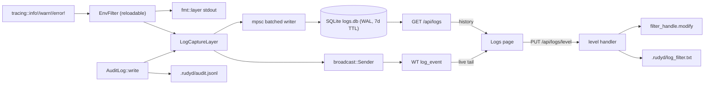

## Backend (`crates/rudydae`)

### 1. Persistent log store (`src/log_store.rs`, new file)

- New dep: `rusqlite = { version = "0.32", features = ["bundled"] }` in [crates/rudydae/Cargo.toml](crates/rudydae/Cargo.toml). `bundled` avoids any system libsqlite hassle on the Pi cross-build.
- One SQLite file at `cfg.paths.log_db` (default `.rudyd/logs.db`, lives next to `audit.jsonl`).
- Schema (single migration, idempotent on startup):

```sql
CREATE TABLE IF NOT EXISTS logs (
  id        INTEGER PRIMARY KEY AUTOINCREMENT,
  t_ms      INTEGER NOT NULL,
  level     INTEGER NOT NULL,           -- 0=trace .. 4=error
  source    INTEGER NOT NULL,           -- 0=tracing 1=audit
  target    TEXT    NOT NULL,
  message   TEXT    NOT NULL,
  fields    TEXT,                        -- JSON
  span      TEXT,
  -- audit-specific
  action    TEXT,
  audit_target TEXT,
  result    TEXT,                        -- 'ok' | 'denied' | 'error'
  session_id   TEXT,
  remote       TEXT
);
CREATE INDEX IF NOT EXISTS idx_logs_t_ms ON logs(t_ms);
CREATE INDEX IF NOT EXISTS idx_logs_level ON logs(level);
CREATE INDEX IF NOT EXISTS idx_logs_source ON logs(source);
```

- WAL mode (`PRAGMA journal_mode=WAL; PRAGMA synchronous=NORMAL;`) so writes don't block readers.
- **Batched writer**: `LogStore` owns a `mpsc::UnboundedSender<LogEntry>` consumed by a single tokio task that drains up to 1,000 entries or 250 ms then commits a single transaction. Bounded backpressure: if the writer falls behind by >50,000 entries it drops oldest and increments a metric (logged at warn — meta!).
- **Retention task**: every 5 minutes runs `DELETE FROM logs WHERE t_ms < (now_ms - retention_days*86_400_000)`; once per day runs `PRAGMA wal_checkpoint(TRUNCATE);` and `VACUUM` if free pages exceed 25%. All knobs in config.
- Read API:
  - `query(filter: LogFilter, limit, before_id) -> Vec<LogEntry>` — newest-first, keyset pagination on `id`.
  - `clear()` — `DELETE FROM logs` + `VACUUM`.
- All operations are blocking SQLite calls wrapped in `tokio::task::spawn_blocking`.

### 2. Tracing layer (`src/log_layer.rs`, new file)

- `tracing_subscriber::Layer` whose `on_event` formats the message + fields via a `Visit` impl into a `serde_json::Map`, builds a `LogEntry`, and:
  1. sends to the `LogStore`'s mpsc (persistence),
  2. sends to a `broadcast::Sender<LogEntry>` (live WT tail).
- The layer reads the `target` from the `Metadata` and walks the current span list to populate `span` (e.g. `motion::sweep:tick`).
- The fmt layer stays as-is so stdout / journald output is unchanged.

### 3. Runtime level control (`main.rs`)

- Replace `tracing_subscriber::fmt().with_env_filter(...)` with:

```rust
let (filter_layer, filter_handle) = tracing_subscriber::reload::Layer::new(
    EnvFilter::try_from_default_env().unwrap_or_else(|_| EnvFilter::new(&cfg.logs.default_filter)),
);
Registry::default()
    .with(filter_layer)
    .with(fmt::layer().with_target(true))
    .with(LogCaptureLayer::new(store.clone(), live_tx.clone()))
    .init();
```

- `filter_handle: tracing_subscriber::reload::Handle<EnvFilter, Registry>` lands in `AppState` so `PUT /api/logs/level` can call `handle.modify(|f| *f = EnvFilter::new(&new_directives))`.
- Persistence: the latest accepted directive string is written to `.rudyd/log_filter.txt`; on next boot it overrides the config default if present (so the operator's last choice survives restarts even though the in-memory filter doesn't).

### 4. Wire types (`src/types.rs`)

- `LogLevel` enum (`trace|debug|info|warn|error`) — `#[derive(TS)]`.
- `LogSource` enum (`tracing|audit`).
- `LogEntry` struct (mirrors the SQLite columns; `audit_*` and `session_id`/`remote` are `Option<String>` so the SPA can render audit-specific extras only when present).
- `LogFilterDirective { target: Option<String>, level: LogLevel }` and `LogFilterState { default: LogLevel, directives: Vec<LogFilterDirective>, raw: String }` for the level endpoints.
- Register `LogEntry` in `declare_wt_streams!` as `kind: "log_event", transport: Stream`.

### 5. REST endpoints (`src/api/logs.rs`, new file)

- `GET /api/logs` — query: `level` (csv), `source` (csv), `q` (substring, applied SQL `LIKE`), `target` (substring), `since_ms`, `before_id`, `limit` (cap 1000). Returns `{ entries: LogEntry[], next_before_id: number | null }`. Newest-first.
- `DELETE /api/logs` — clears the store (audit-logged as `action=logs_clear`).
- `GET /api/logs/level` → current `LogFilterState`.
- `PUT /api/logs/level` — body `{ raw: string }` (e.g. `"rudydae=info,rudydae::can=debug"`). Parses with `EnvFilter::try_new`, returns 400 + `ApiError` on parse failure, otherwise atomically swaps via `filter_handle.modify(...)`, persists to `.rudyd/log_filter.txt`, audit-logs the change, and returns the new `LogFilterState`.
- Wired into `src/api/mod.rs`.

### 6. Audit log integration

- `AuditLog::write` keeps writing to `audit.jsonl` (so the file remains a tamper-evident operator-actions record), and additionally hands a `LogEntry { source: Audit, level: derive_from_result(), action, audit_target, result, session_id, remote, fields: details }` to the same `LogStore` + `broadcast::Sender` used by the tracing layer.
- One unified table → one query path → audit and tracing logs filter/sort/paginate together.

### 7. Config (`src/config.rs` + `config/rudyd.toml`)

```toml
[logs]
db_path = ".rudyd/logs.db"
retention_days = 7
default_filter = "rudydae=info,tower_http=info"
batch_max_rows = 1000
batch_flush_ms = 250
purge_interval_s = 300
```

All fields default in `Config` so existing configs keep working.

## Frontend (`link`)

### 8. API + types

- `npm run gen:types` regenerates `LogEntry.ts`, `LogLevel.ts`, `LogSource.ts`, `LogFilterDirective.ts`, `LogFilterState.ts`, `WtKind.ts`, `WtFrame.ts`.
- Extend [link/src/lib/api.ts](link/src/lib/api.ts):
  - `api.logs.list(params) -> { entries: LogEntry[]; next_before_id: number | null }`
  - `api.logs.clear() -> { ok: true }`
  - `api.logs.getLevel() -> LogFilterState`
  - `api.logs.setLevel(raw: string) -> LogFilterState`

### 9. WT bridge reducer

In [link/src/lib/hooks/wtReducers.ts](link/src/lib/hooks/wtReducers.ts), add a `log_event` reducer keyed at `["logs","live"]`: capped 5k FIFO client buffer, rAF-coalesced merge into the cache. Add to `DEFAULT_REDUCERS`.

### 10. Logs page (`link/src/routes/_authed.logs.tsx` — replace)

Two-pane layout, mirroring the look of [link/src/routes/_authed.params.tsx](link/src/routes/_authed.params.tsx):

- **Header**: title, live/paused indicator (`useWtConnected`), shown count, "Pause", "Clear", and a small **Level** popover (see below).
- **Filter bar (sticky)**: level multi-select with color chips, source toggle (Tracing/Audit/Both), target substring, free-text search, "Errors only" quick toggle, time window dropdown ("Live", "Last 5m", "Last 1h", "Last 24h", "Last 7d"). Filters live in TanStack Router search params so views are shareable and reload-safe.
- **Left list (~60% width)**: dense rows — time `HH:MM:SS.mmm`, colored level badge, target/action, message truncated. Windowed render keyed off a `useMemo` slice (no new dep). "Jump to live" button when scrolled away from the top.
- **Right detail pane (~40% width)**: full timestamp, level, target, span path, full message in a monospace pre, pretty-printed `fields` JSON (collapsible), and — for audit entries — `Action / Target / Result / Session / Remote` rows. "Copy as JSON" button.

### 11. Runtime level control UI (`level-control.tsx`)

- Popover triggered from the header.
- Inside:
  - Current effective filter shown as a read-only line (`raw`).
  - Quick-toggle chips for common targets: `rudydae`, `rudydae::can`, `rudydae::motion`, `rudydae::wt`, `tower_http`. Each chip is a 5-position level segmented control (trace/debug/info/warn/error).
  - "Advanced" textarea bound to the raw `EnvFilter` directive string for power users.
  - "Apply" button calls `api.logs.setLevel(raw)`. On 400, render the parser error inline.
  - "Reset to default" reverts to `cfg.logs.default_filter`.
- A subtle warning toast when any directive is `trace` or `debug` ("verbose logging is on; remember to restore before leaving").

### 12. Components (`link/src/components/logs/`)

- `log-list.tsx`, `log-row.tsx`, `log-detail.tsx`, `log-filter-bar.tsx`, `level-control.tsx`, `level-badge.tsx`, `index.ts` barrel.

### 13. Data fetching

- History: `useInfiniteQuery(["logs", filters], ({ pageParam }) => api.logs.list({ ...filters, before_id: pageParam, limit: 500 }))` — scrolling near the bottom triggers `fetchNextPage`.
- Live tail: WT reducer-populated `["logs","live"]` buffer is merged with the first page by `id` (dedupe), then client-side filtered. WT down → fall back to a `refetchInterval: 2_000` on the first page.
- "Pause" stops the merge so the operator can read a frozen snapshot during an incident.

### 14. Smoke contract additions

Extend [link/scripts/smoke-contract.mjs](link/scripts/smoke-contract.mjs):

- `GET /api/logs?limit=10` — assert `entries` array + each has `id, t_ms, level, source, target, message`.
- `GET /api/logs/level` — assert `default, directives, raw`.

## Data flow



## Out of scope (kept simple)

- No journald integration (Linux-only; rudydae's own captured logs already cover the same ground).
- No log export endpoint (can be added later as a streaming JSONL `GET /api/logs/export`).
- No multi-file log shipping / remote sink (single-Pi deployment doesn't need one yet).
