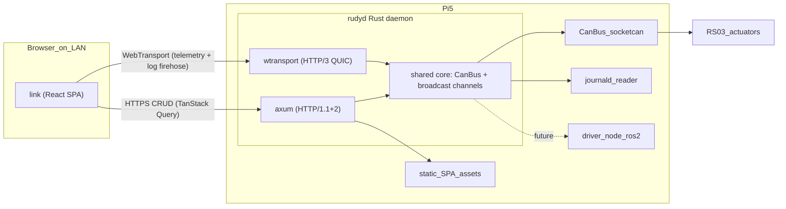

# Rudy operator console

## Goals

- One browser tab on the LAN/Tailscale with: live telemetry charts, firmware parameter editor (replaces Motor Studio for RS03), jog/enable controls, URDF 3D view, log tail.
- Fits into the two-machine topology in [docs/architecture.md](docs/architecture.md): UI served from the Pi, desktop just visits it in a browser. No new machine.
- Lands the piece the repo already assumes exists but doesn't: a long-lived process that owns `can0`/`can1` and can be shared by `ros2_control` later.

## Architecture



Key decision: **one process on the Pi owns the bus.** `rudyd` subsumes what `bench_tool` does today; `bench_tool` becomes a thin CLI client of `rudyd` (or stays standalone for the "daemon is down" case — TBD). When the ROS 2 `driver_node` lands, it runs *inside* `rudyd` as another consumer of the same shared bus handle, not as a competitor.

## Stack choices (with why)

- **Backend: Rust, dual-listener.** `axum` + `tokio` serves HTTP/1.1+2 for CRUD and embedded static assets. [`wtransport`](https://docs.rs/wtransport) (QUIC-based HTTP/3) serves the telemetry + log firehose on its own UDP port. Both listeners share an in-process core (CAN bus handle + `tokio::sync::broadcast` channels). Same toolchain as the driver; can `use driver::rs03::session::*` directly (see `ros/src/driver/src/rs03/session.rs` post-reorg).
- **CAN ownership: `socketcan` async wrapper** around the existing `ros/src/driver/src/socketcan_bus.rs` (post-reorg path). Single writer task, broadcast channels to both the axum handlers and the WebTransport session tasks.
- **TLS: Tailscale HTTPS on the Pi.** Tailscale-provisioned Let's Encrypt cert (via `tailscale cert` + `tailscale serve` or native integration) gives us a real cert chain without cert-rotation glue. `rudyd` only binds Tailscale-local addresses. Anything outside Tailscale gets no response.
- **Frontend: Vite + React + TypeScript.** UI library is **shadcn/ui** (all components; Tailwind v4); `TanStack Query` owns all HTTP server-state (params, inventory, fault history, config) with standard cache keys + optimistic mutations; `TanStack Router` handles typed routing, with search params carrying selectable UI state (current motor ID, chart time range, jog mode) so it's shareable/bookmarkable; plain React `useState`/`useReducer` for the rest. **No global state library** — we'll add Zustand (or Jotai, or Redux) only when an actual shared-state need emerges that local + URL + server state can't express cleanly. `uPlot` for telemetry strip charts; `three-fiber` + `urdf-loader` for the 3D view. Lives in its own top-level `link/` project; `link/dist/` is embedded into `rudyd` via `rust-embed` for Pi deploys.
- **shadcn tooling:** component adds go through the **shadcn MCP server** ([ui.shadcn.com/docs/mcp](https://ui.shadcn.com/docs/mcp)) so AI-driven component installs + the shadcn skill stay in sync. Prereq: user runs `npx skills add shadcn/ui` and enables the MCP server in Cursor Settings before execution starts — the skill is not yet installed locally and the MCP server is not yet in the enabled MCP list.
- **Transport split:**
  - **HTTPS + TanStack Query** for everything request/response: `GET /api/motors`, `GET/PUT /api/motors/:id/params`, `POST /api/motors/:id/{enable,stop,save,set_zero}`, `GET /api/config` (advertises WebTransport URL + features), `GET /api/inventory`, etc. Curlable, cacheable, optimistic-update-friendly.
  - **WebTransport + browser-native WebTransport API** for the push firehose: high-rate telemetry (mechPos, mechVel, vbus on unreliable datagrams), fault + warn events (reliable unidirectional streams), journald log tail (reliable unidirectional stream). Client opens one session, requests the subscriptions it wants, server multiplexes. No WebSocket fallback — per user decision, Tailscale HTTPS is the transport floor.
  - Wire format: `ts-rs`-generated TypeScript types from Rust `serde` structs. JSON on the REST side for debuggability; CBOR on the datagram side for throughput (CBOR is schema-compatible with serde JSON, so one Rust struct serves both).
- **Auth: shared bearer token** injected by an axum middleware, validated on every `/api/*` request and on WebTransport session open (presented as a `?token=` query param since WebTransport has no header-setting API in browsers). Token file referenced by `config/rudyd.toml`. Audit log `~/.rudyd/audit.jsonl` captures every mutating REST request + every WebTransport session open/close.
- **Config/schema: generate the parameter catalog from [config/actuators/robstride_rs03.yaml](config/actuators/robstride_rs03.yaml)** at build time so the UI's param editor inherits indices, types, units, hardware ranges, and commissioning defaults automatically. No second source of truth.

## Safety model (non-negotiable)

The firmware layering in [docs/robotics-best-practices-reference.md](docs/robotics-best-practices-reference.md) still holds — `rudyd` is **strictly outside** the firmware `limit_*` envelope. In addition:

- **Write confirmation:** every param write round-trips a server-side dry-run (range-check against `firmware_limits.hardware_range` + commissioning caps), requires a typed-confirm dialog in the UI, and logs to a append-only `~/.rudyd/audit.jsonl`.
- **Save-to-flash is its own button**, never implicit. Matches the Step 6/7 split in [tools/robstride/commission.md](tools/robstride/commission.md).
- **Jog UI has a dead-man switch:** holding a key sends command packets at ≥ 20 Hz; releasing → server cancels → `cmd_stop`. `can_timeout` from the motor side is the backstop.
- **Single-operator lock:** `rudyd` refuses to enable / write when another session is already "in control." First-come, with a visible "take over" button.
- **Enable-gated by `inventory.yaml:verified`.** Same gate the Rust driver uses per [tools/robstride/commission.md](tools/robstride/commission.md); the UI must not provide a way to bypass it.

## Phasing (weeks, not days)

Phase 0 is a prerequisite — the repo reorg that makes the rest fit cleanly. Phase 1 is the useful-immediately core; 2 and 3 are the "tons of other things."

- **Phase 0 — top-level reorg.** `src/` → `ros/src/`, introduce `crates/` as a Cargo workspace (initially containing only `rudyd` once it's scaffolded). All path references in CI, docs, runbooks, scripts, tests, and tools updated in a single commit so blame-through-move works. Local verification: `cd ros && colcon build` clean, `(cd ros/src/driver && cargo test)` passes.

- **Phase 1 — telemetry + params (MVP that replaces Motor Studio for you):** `rudyd` skeleton with both listeners (axum + wtransport), Tailscale cert wiring, CAN ownership, type-17 poller, WebTransport datagram stream, REST `GET/PUT /params`, `link/` SPA shell with shadcn/ui theme + TanStack Query client, param editor, live uPlot charts for `mechPos`/`mechVel`/`vbus`/`faultSta` driven by WebTransport datagrams. Success = write `limit_torque` from the browser and verify across PSU cycle.
- **Phase 2 — control + viz:** jog panel, enable/disable, set-zero + save-to-flash flows, URDF 3D view driven by live `joint_states` reconstructed from per-motor `mechPos`, log tail (journald `rudyd` + kernel CAN errors).
- **Phase 3 — operations:** multi-motor fan-in when actuator_b arrives, rosbag-style session recording, fault-history browser, sim-link (plot Isaac Lab ghost vs real), Tailscale-exposed HTTPS.

## Layout (post-reorg)

Step 0 reorganizes the top level so every top-level folder names a distinct concern and no single folder dominates. After Step 0 the tree is:

```
rudy/
├── ros/                  # ROS 2 colcon workspace root
│   └── src/              # colcon packages live here (colcon expects "src" as its subdir)
│       ├── description/ bringup/ msgs/ control/ telemetry/ simulation/ tests/ driver/
├── crates/               # Cargo workspace for non-ROS Rust
│   ├── Cargo.toml        # [workspace] members = ["rudyd"]
│   └── rudyd/            # the new daemon
├── link/                 # Vite + React + TS frontend
├── config/               # actuator specs, rudyd.toml, inventory
├── deploy/               # Pi 5 bring-up, systemd units, Tailscale cert runbook
├── docs/                 # architecture, ADRs, runbooks, research
├── tools/                # robstride bench scripts, motor-studio exports, etc.
├── scripts/              # repo-level helpers (validate_urdf.py, etc.)
└── tests/                # cross-cutting parity tests (URDF ↔ actuator spec)
```

Per-folder detail for the new pieces:

- `crates/rudyd/` — Binary `rudyd`. Depends on `driver = { path = "../../ros/src/driver" }` (driver stays in the ROS workspace today because it's a hybrid ament/cargo package; splitting it into a pure `crates/driver/` + thin `ros/src/driver_node/` is a future ADR). Two listener tasks inside one binary: axum on `:8443` (HTTPS, Tailscale cert) and wtransport on `:4433/udp` (HTTP/3). `build.rs` copies `../../link/dist/` into `crates/rudyd/static/` pre-compile (skipped when `RUDYD_NO_EMBED=1` for Vite dev loop).
- `link/` — own `package.json`, `tsconfig.json`, `.eslintrc`, Vitest config. shadcn/ui (via `components.json`), TanStack Query, TanStack Router, uPlot, three-fiber, urdf-loader. `link/src/api/generated/` holds ts-rs-generated TS types mirroring `rudyd`'s Rust structs. Can be pointed at a remote `rudyd` via `VITE_RUDYD_URL`.
- `deploy/pi5/tailscale-cert.md` — runbook fragment on provisioning the Tailscale cert + wiring it into `rudyd.service`.
- `ros/src/driver_node/` (future, not Phase 1) — thin ROS 2 ament package that wraps the Rust driver crate for `ros2_control` consumption. Creating this is the trigger for the eventual `driver` → `crates/driver/` split.
- `config/rudyd.toml` — port, bind addr, token file path, audit log path, inventory path.
- `deploy/pi5/rudyd.service` — systemd unit, `After=network-online.target`, `User=rudy`, `AmbientCapabilities=CAP_NET_RAW` for SocketCAN.
- `docs/decisions/0004-operator-console.md` — ADR capturing the "one daemon owns the bus" decision and the safety model above.
- `docs/runbooks/operator-console.md` — how to start/stop, rotate the token, read the audit log.

## Open items I'd like to decide before writing code

- Whether `bench_tool` stays CAN-direct (for "daemon is down" rescue) or becomes a thin REST client of `rudyd`. I lean: **keep both**, gated by `--direct` flag, because you want a working CLI when the daemon is crashed.
- Telemetry wire format resolved: JSON over HTTPS/REST, CBOR over WebTransport datagrams (same serde structs).
- Whether to bake in a Grafana-style "dashboard" config (saved views) in Phase 1 or defer to Phase 3.