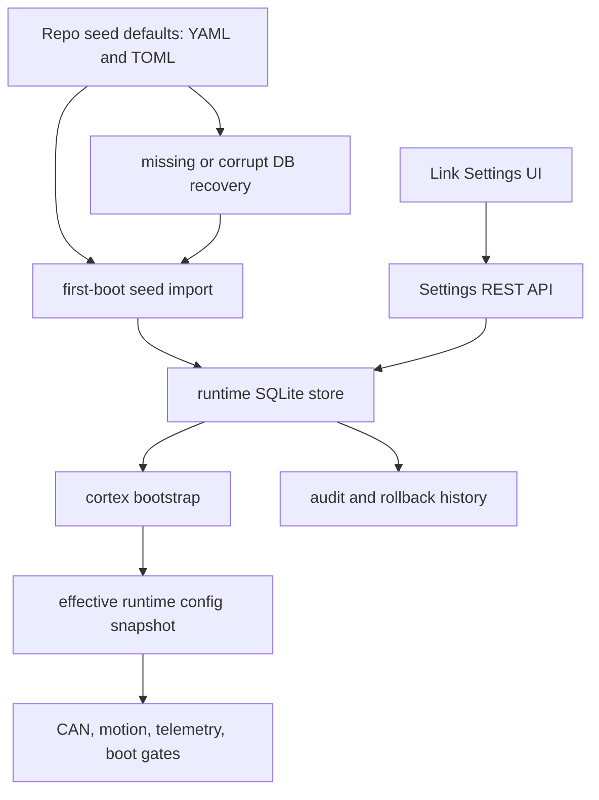

# Runtime Config Migration Plan

## Target Architecture

Keep files for seed defaults and hardware truth; make SQLite the durable operator state after first successful import.

Config ownership after migration:

- Static boot config stays in `[config/cortex.toml](config/cortex.toml)`: HTTP/WT bind, cert paths, CAN interface discovery, paths, DB locations, read-only actuator spec path.
- Seed defaults stay in `[config/cortex.toml](config/cortex.toml)` and `[config/actuators/*.yaml](config/actuators)`: first-boot input, recovery input, export/CI fixtures, and URDF parity source material.
- Live runtime settings live in SQLite after first boot: safety tuning, homing/motion defaults, selected telemetry knobs, profiles, and later actuator inventory/motion fields.
- Normal startup does not re-merge YAML into an existing healthy DB. YAML changes only affect new DB creation, explicit re-seed, or manual import/export flows.
- No control loop reads SQLite directly. Loops read an in-memory validated snapshot from `[crates/cortex/src/app/state.rs](crates/cortex/src/app/state.rs)`.

## Phase 0: Classify Settings

Create a setting ownership map before code movement.

- Classify every field in `[crates/cortex/src/config/safety.rs](crates/cortex/src/config/safety.rs)`, `[crates/cortex/src/config/telemetry.rs](crates/cortex/src/config/telemetry.rs)`, `[crates/cortex/src/config/can.rs](crates/cortex/src/config/can.rs)`, and `[crates/cortex/src/hardware/inventory/devices.rs](crates/cortex/src/hardware/inventory/devices.rs)`.
- Mark each as `read_only_static`, `static_restart_required`, `runtime_immediate`, `runtime_next_command`, or `runtime_requires_stopped_motors`.
- Define validation metadata: type, unit, min/max, default source, safety class, and whether UI needs confirmation.
- Treat “tune every setting” as “show every setting.” Some settings must be read-only or restart-required, including bind addresses, cert paths, CAN buses, DB paths, and actuator spec paths.
- Define cross-field validators for settings that interact. Single-key range checks are not enough for homing and motion values where `tick_interval_ms`, `step_size_rad`, homing speed, freshness windows, and debounce ticks affect each other.
- Document the split in `[docs/architecture.md](docs/architecture.md)` and likely add an ADR under `[docs/decisions](docs/decisions)`.

Initial likely split:

- Static: bind addresses, cert paths, CAN bus list, actuator spec path, audit/log/settings DB paths.
- Runtime global: `require_verified`, `max_feedback_age_ms`, homing ramp values, tracking/debounce tolerances, hold kp/kd defaults, `auto_home_on_boot`, `scan_on_boot`.
- Runtime but not hot-swapped initially: telemetry polling cadence; can be marked restart-required or loop-restart-required first.
- Per-actuator phase 2: `travel_limits`, `predefined_home_rad`, `homing_speed_rad_s`, `desired_params`, `commissioned_zero_offset`, hold overrides.

## Phase 1: Global Runtime Store

Add a SQLite-backed settings store beside existing log storage.

- Add a new config section, likely `[settings] db_path = "/var/lib/rudy/settings.db"`, modeled after `[crates/cortex/src/config/logs.rs](crates/cortex/src/config/logs.rs)`.
- Add a new module like `crates/cortex/src/settings_store/` using existing `rusqlite` dependency from `[crates/cortex/Cargo.toml](crates/cortex/Cargo.toml)`.
- Use migrations for tables such as `settings`, `settings_events`, `profiles`, `profile_settings`, and `store_metadata`.
- On startup in `[crates/cortex/src/app/bootstrap.rs](crates/cortex/src/app/bootstrap.rs)`, load `[Config::load](crates/cortex/src/config/mod.rs)`, then:
  - If settings DB is missing, create it and import seed values from TOML/YAML.
  - If settings DB is present and healthy, load settings from DB only.
  - If settings DB is corrupt or schema-invalid, move it aside with a timestamp, create a fresh DB from seed files, log/audit the recovery, and surface a warning in `/api/settings`.
- If DB recovery re-seeds from YAML/TOML, boot into a “recovered from seed” safety state: disable `auto_home_on_boot` and refuse motion-producing commands until the operator acknowledges the recovery in the UI or via API.
- Add `AppState` accessors for runtime settings instead of direct reads from `state.cfg.safety` everywhere.
- Keep `state.cfg` for static boot config only, then gradually replace runtime reads found under `[crates/cortex/src/can](crates/cortex/src/can)`, `[crates/cortex/src/motion](crates/cortex/src/motion)`, and `[crates/cortex/src/hardware/boot](crates/cortex/src/hardware/boot)`.

Application rule: DB writes update the DB and then atomically swap the in-memory snapshot. Motion code takes a snapshot at command start; no partial setting changes mid-command unless explicitly designed.

Validation rule: every update validates both the changed key and the full effective snapshot before it is committed. Profile apply is all-or-nothing for the same reason.

Store metadata should record seed source paths, seed file hashes, schema version, created-at, and last successful validation. This makes it clear when checked-in YAML changed after the DB was seeded without silently overwriting operator-tuned values.

## Phase 2A: Settings API Contract

Expose typed settings through a stable backend contract before building the full UI.

- Add REST routes under `[crates/cortex/src/api/meta](crates/cortex/src/api/meta)` or a new `api/settings` module:
  - `GET /api/settings` for definitions, effective values, defaults, source, dirty/restart status.
  - `PUT /api/settings/:key` for validated updates.
  - `POST /api/settings/reset` to clear overrides.
  - `POST /api/settings/reseed` for deliberate re-import from YAML/TOML, guarded by confirmation and audit.
  - `GET/POST /api/settings/profiles` for named profiles.
  - `POST /api/settings/profiles/:name/apply` for profile switching.
- Make `GET /api/settings` registry-driven, not hand-picked. Every configurable key must appear with category, label, description, type, unit, current value, seed/default value, DB value, min/max/options, editability, apply mode, safety class, last changed, and restart/motor-stop requirement.
- Make apply semantics explicit in the API response and mutation response: `applied_immediately`, `applies_next_command`, `requires_stopped_motors`, `requires_restart`, or `read_only`.
- Audit every accepted/denied change through existing audit patterns in `[crates/cortex/src/api/meta/logs.rs](crates/cortex/src/api/meta/logs.rs)` and motor mutators.
- Use the existing control lock behavior from `[crates/cortex/src/app/state.rs](crates/cortex/src/app/state.rs)` for settings that can affect motion.
- Generate TypeScript bindings with `ts-rs`; update `[link/src/lib/types](link/src/lib/types)`, `[link/src/lib/api.ts](link/src/lib/api.ts)`, and `[link/src/api/queries.ts](link/src/api/queries.ts)`.
- Add API/contract tests before UI work so the page has a stable schema to render.

Exit criteria: `GET /api/settings` can describe every setting, `PUT` can validate/update a setting, profile endpoints round-trip, audit entries are written, and generated TypeScript types exist.

## Phase 2B: Settings UI

Build the operator-facing page against the Phase 2A contract.

- Add a new `Settings` menu item to the shell nav in `[link/src/components/app-shell.tsx](link/src/components/app-shell.tsx)`, likely `/settings` with a `Settings2` or `SlidersHorizontal` icon.
- Add a new route file under `[link/src/routes](link/src/routes)`, likely `_app.settings.tsx`, for a full Settings page.
- UI should show seed/default value, DB/effective value, override source, unit, validation range, last changed time, and whether restart/motor-stop is required.
- UI should show read-only and restart-required settings alongside editable settings so the operator can inspect every config value without implying every value can be hot-tuned.
- UI must provide an editor for every setting returned by the registry:
  - boolean: switch.
  - enum/options: select or segmented control.
  - numeric: input plus optional slider when range is bounded.
  - string/path: text input with restart-required badge.
  - JSON/object/list: advanced structured editor with validation preview.
- UI should have category navigation and search/filter so “every single setting” remains usable as config grows.
- UI should include dirty-state handling: edited draft, validate, apply one, apply all safe changes, reset to seed/default, and clear DB override.
- UI should make safety state obvious: badges for `live`, `next command`, `requires stopped motors`, `restart required`, `advanced`, and `reseeded from YAML`.
- UI must show a blocking recovery banner when the server reports “recovered from seed,” with an explicit acknowledge action before motion/auto-home can resume.
- UI should include a profile panel for `bench`, `low_power`, `walking_dev`, `production`, plus compare/apply/reset flows.

The current log level editor is useful precedent: `[link/src/components/logs/level-control.tsx](link/src/components/logs/level-control.tsx)` already edits a runtime value and persists it.

The Settings page should use existing primitives where possible: shell/nav from `[link/src/components/app-shell.tsx](link/src/components/app-shell.tsx)`, confirmation behavior from `[link/src/components/params/confirm-dialog.tsx](link/src/components/params/confirm-dialog.tsx)`, and firmware-param editing patterns from `[link/src/components/params/param-row.tsx](link/src/components/params/param-row.tsx)`. The design direction should be utilitarian and dense, closer to a robot commissioning console than a generic preferences page.

Exit criteria: `/settings` appears in desktop/mobile nav, renders every setting returned by the registry, supports draft/apply/reset flows, and passes typecheck/API contract tests.

## Phase 3: Global Tunable Migration

Move global runtime fields first; leave actuator inventory YAML alone temporarily.

- Seed DB values from `config/cortex.toml` on first run. After that, DB is authoritative; TOML is only recovery/new-install seed unless the operator explicitly re-seeds.
- Change `[deploy/pi5/render-cortex-toml.sh](deploy/pi5/render-cortex-toml.sh)` so release updates no longer overwrite operator-tuned safety values. It should emit static boot config plus `settings.db_path` only.
- Preserve existing behavior during the migration window, but once a DB is seeded, every migrated key should have a DB row so absence is treated as store corruption/schema bug, not an implicit file fallback.
- Mark some settings as `restart_required` initially if live-reload is risky, then relax after tests/HIL confidence.
- Migrate `PUT /api/logs/level` later or leave it as a specialized endpoint; either is acceptable once global settings store exists.

## Phase 4: Inventory And Actuator Settings Migration

After global store is stable, move mutable actuator state out of `[config/actuators/inventory.yaml](config/actuators/inventory.yaml)`.

- Keep repo `inventory.yaml` as seed/export format, not live mutable state.
- Replace `[crates/cortex/src/hardware/inventory/store.rs](crates/cortex/src/hardware/inventory/store.rs)` writes with a DB-backed inventory store.
- Keep the existing `[Inventory](crates/cortex/src/hardware/inventory/mod.rs)` type as an in-memory projection so most motion/CAN code changes stay small.
- Import seed inventory into DB on first boot. On later boots, load from DB only. If inventory tables are missing/corrupt, quarantine the bad DB or bad inventory partition and re-import from seed YAML with an operator-visible warning.
- Add export tooling to write a reviewed YAML snapshot from DB for backup, diffs, and CI fixtures.
- Move mutators currently rewriting YAML: travel limits, predefined home, homing speed, desired params, verified, rename/assign, onboarding, commission/restore offset.
- For safety-critical actuator changes, require control lock, motor stopped, validation against actuator spec, audit event, and backup-friendly event history.

## Phase 5: ROS, Sim, And CI Boundary

Do not make ROS or sim depend directly on live SQLite in the first migration.

- Keep ROS YAML under `[ros/src](ros/src)` as package defaults.
- Keep actuator spec and URDF parity tests using checked-in defaults: `[tests/test_actuator_spec.py](tests/test_actuator_spec.py)`, `[tests/test_urdf_spec_parity.py](tests/test_urdf_spec_parity.py)`, and `[crates/cortex/src/hardware/spec](crates/cortex/src/hardware/spec)`.
- Add tests that import seed YAML into a temp settings DB and export it back to equivalent YAML.
- If ROS later needs live operator-tuned values, add an explicit export/sync step or ROS service bridge. Avoid ROS nodes reading SQLite ad hoc.

## Validation And Rollout

Use narrow checks at each phase, then full ship checks before deploy.

- Rust unit tests for validation, merge precedence, profile apply/reset, and DB migrations.
- Startup tests for first-boot seed import, healthy DB reuse despite changed YAML, missing DB re-seed, and corrupt DB quarantine/re-seed.
- API tests alongside `[crates/cortex/tests/api](crates/cortex/tests/api)` for settings CRUD, audit entries, lock enforcement, read-only refusal, cross-field validation, apply-mode reporting, recovery acknowledgement, and restart-required flags.
- UI tests/typecheck after generated bindings update, including route/nav coverage for `/settings`, generic editor rendering for every setting type, dirty/apply/reset flows, and Settings API contract coverage in `[link/src/lib/__tests__/api.contract.test.ts](link/src/lib/__tests__/api.contract.test.ts)`.
- Deployment dry run for Pi paths: `/etc/rudy/cortex.toml`, `/var/lib/rudy/settings.db`, `/var/lib/rudy/logs.db`, `/var/lib/rudy/audit.jsonl`.
- Rollback: stop cortex, back up/delete `settings.db`, restart to re-seed from files; for phase 4, export inventory before every migration and keep importer idempotent.

## Main Risks

- Accidentally treating safety-critical changes as immediate when they should only affect the next command or require stopped motors.
- Re-seeded DB could restore stale YAML defaults; motion and auto-home must stay blocked until operator acknowledges the recovery.
- Static config may be visible in Settings but must remain read-only or restart-required.
- Single-key validation can miss unsafe combinations; every commit needs whole-snapshot validation.
- Hidden direct reads of `state.cfg.safety` causing some loops to ignore live settings.
- `render-cortex-toml.sh` overwriting values during deploy if not narrowed to static config.
- Silent fallback to YAML on a partial DB read would hide corruption. Startup should either use a fully valid DB or quarantine/re-seed with an explicit warning.
- Inventory migration touching many endpoints at once; this is why it should be phase 2 after global settings pattern is proven.
- CI seeing stale YAML if DB becomes authoritative without an export/import fixture strategy.

