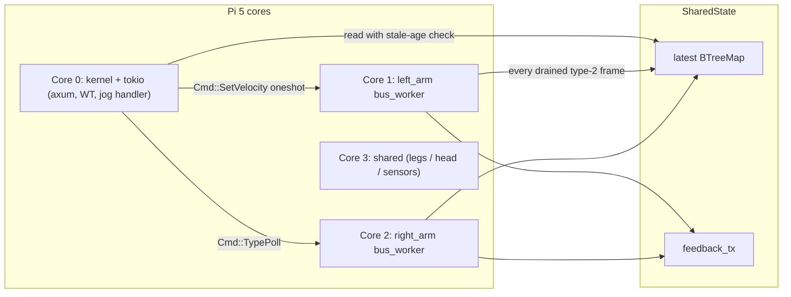

# Sweep-safe CAN I/O

## Why this happens today

The "Sweep travel limits" timer in [link/src/components/actuator/motion-tests-card.tsx](link/src/components/actuator/motion-tests-card.tsx) and the daemon's band check in [crates/rudydae/src/api/jog.rs](crates/rudydae/src/api/jog.rs) both depend on the same input: `state.latest.<role>.mech_pos_rad`. There is **no other safety check** on the jog path.

```163:175:crates/rudydae/src/api/jog.rs
    if let Some(fb) = state.latest.read().expect("latest poisoned").get(&role) {
        let projected = fb.mech_pos_rad + clamped * (ttl_ms as f32 / 1000.0);
        let check =
            enforce_position_with_path(&state, &role, fb.mech_pos_rad, projected) ...
```

When sweep starts, `set_velocity_setpoint` ([crates/rudydae/src/can/linux.rs:165-187](crates/rudydae/src/can/linux.rs)) writes 3 frames per call at 20 Hz on the same per-bus `Mutex` that `poll_once` ([crates/rudydae/src/can/linux.rs:288-325](crates/rudydae/src/can/linux.rs)) needs to do its 4 type-17 round-trips. Once a `read_live_feedback` errors out (ENOBUFS / recv error during contention), `MotorBackoff` ([crates/rudydae/src/can/backoff.rs](crates/rudydae/src/can/backoff.rs)) skips the motor and `state.latest` is **never overwritten** — it stays frozen at whatever it last was. Both safety checks then approve every subsequent jog forever.

## The new architecture



One OS thread per `[[can.buses]]` entry owns its `CanBus` exclusively, pinned to its own CPU on the Pi 5. The thread runs a tight loop:

1. `bus.recv()` with a short (~5 ms) timeout. Every type-2 frame received is decoded and pushed into `state.latest` + `feedback_tx` immediately. Type-17 replies in flight get matched to pending commands.
2. Drain at most N (e.g. 8) commands from a `crossbeam_channel::Receiver<Cmd>`. Each command issues its frame(s) on the bus and (for reads / writes that need ack) parks a oneshot in a `pending: HashMap<reply_key, Sender>` so the next `recv` can complete it.

This puts ~60 Hz of type-2 feedback into `state.latest` with zero blocking on type-17 round-trips, serializes writes naturally without a global mutex, and on the Pi 5 keeps each limb's I/O loop on its own L1/L2 cache without scheduler jitter.

## Files to change

### Daemon: new I/O layer

- New module `crates/rudydae/src/can/bus_worker.rs`: defines `enum Cmd { SetVelocity, Stop, Enable, WriteParam, ReadParam, SaveParams, SetZero }`, the per-bus thread loop, and `BusHandle { tx: crossbeam_channel::Sender<Cmd> }`. Reuses `driver::CanBus` and `driver::rs03::session::*` for actual frame I/O. The thread owns matching of type-17 replies to in-flight `ReadParam` / `WriteParam` commands by `(motor_id, index)`.

- `crates/rudydae/src/can/linux.rs`: replace `LinuxCanInner { buses: BTreeMap<String, CanBus> }` and the `with_bus` mutex with `BTreeMap<String, BusHandle>`. Every existing `pub fn` (enable, stop, set_velocity_setpoint, write_param, read_*) becomes a thin wrapper that builds a `Cmd`, sends it, and (where needed) blocks on the oneshot reply. The signatures stay identical so callers in `api/`, `home/`, `auto_recovery/` don't change.

- `crates/rudydae/src/can/linux.rs::set_velocity_setpoint`: only re-issue `RUN_MODE` + `cmd_enable` on transition from "not currently driving" → driving (tracked via `state.enabled` set, which already exists). Subsequent jog frames send only `SPD_REF`. Cuts bus traffic from 60 to 20 frames/s during sweep.

- Delete the now-redundant per-tick `read_named_f32(mech_pos|mech_vel|vbus)` calls in `read_live_feedback`. Type-2 frames carry pos/vel/torque/temp directly and arrive on every `cmd_enable` / `set_velocity_setpoint` round-trip plus on `MotorFeedback` request frames the worker can issue periodically. Keep type-17 reads only for `fault_sta` and `vbus` at a slower cadence (~5 Hz) since those don't ride type-2.

### Daemon: CPU pinning (Pi 5)

- Add `core_affinity = "0.8"` (small, well-maintained, cross-platform with no-op on unsupported targets) to `crates/rudydae/Cargo.toml`.

- `crates/rudydae/src/config.rs`: optional `cpu_pin: Option<usize>` field on the existing `[[can.buses]]` block.

- `crates/rudydae/src/can/bus_worker.rs::spawn`: after the worker thread starts, call `core_affinity::set_for_current(CoreId { id: pin })`. If `cpu_pin` is `None`, the supervisor that spawns the workers auto-assigns from cores `1..=num_cpus-1` round-robin (skipping core 0 to leave it for kernel + tokio). If the requested core is out of range or `core_affinity` returns false (dev machines, mock CAN), log a `debug!` and continue without pinning.

- No `SCHED_FIFO` / RT priority in this PR — affinity alone is the high-value, low-risk win. RT priority is a follow-up after we have soak data and have decided on the `CAP_SYS_NICE` posture.

- Pi 5 specifics: 4 cores total, no SMT. With ~4 limb buses planned, the natural assignment is one limb per core 1-3, with core 0 carrying the kernel, tokio runtime, axum, WebTransport, and any spare-core sensor I/O.

### Daemon: stale-feedback fail-closed

- `crates/rudydae/src/config.rs`: add `safety.max_feedback_age_ms: u64` (default `100`).

- `crates/rudydae/src/api/jog.rs:163-224`: change the `if let Some(fb)` block. The new policy: if no entry exists, OR `now_ms - fb.t_ms > max_feedback_age_ms`, return `409 Conflict` with `error: "stale_telemetry"`, `detail: "no fresh feedback for {role}; refusing motion"`. This converts the silent-pass into an explicit refusal that the SPA already handles (it stops the sweep loop on any 4xx).

### Daemon: poll cadence

- `config/rudyd.toml`: `poll_interval_ms = 16` (≈60 Hz). The new bus_worker streams type-2 in real time so this just controls the slow-cadence type-17 sweep for `fault_sta` / `vbus`.

- `crates/rudydae/src/can/backoff.rs`: `INITIAL_BACKOFF` from 100 ms to 16 ms to match the new tick. Update the doc comment.

### SPA: align cadence + show stale state

- `link/src/components/actuator/motion-tests-card.tsx`: `SEND_INTERVAL_MS` from 50 → 16 (60 Hz), `TTL_MS` from 200 → 100. Add a stale-feedback guard: in `tick()`, compute `Date.now() - motor.latest.t_ms` and bail with `stopMotion("Telemetry stalled")` if > 100 ms. Mirrors the daemon-side check so the SPA stops sending before the daemon has to refuse.

- `link/src/components/actuator/dead-man-jog.tsx`: same `SEND_INTERVAL_MS` 50 → 16 for consistency.

- `link/src/lib/hooks/wtReducers.ts`: confirm the rAF batching still works at 60 Hz (it should — rAF *is* 60 Hz, so we just stop coalescing).

### Deploy: kernel-side IRQ affinity (Pi 5)

- `deploy/pi5/bootstrap.sh`: after each `ip link set <iface> up`, find the IRQ for that interface (parse `/proc/interrupts` for the `<iface>` row) and write the matching CPU number to `/proc/irq/<n>/smp_affinity_list`. The CPU mapping mirrors what rudydae will pick (auto-assign from core 1..N, in the order `[[can.buses]]` is declared in the config — bootstrap reads the same `rudyd.toml` so they stay in sync).

- The benefit on Pi 5 is real: the SocketCAN softirq runs on whichever CPU received the hard IRQ. Pinning the IRQ to the same core as the user-space worker means the kernel-side packet path and our recv loop stay co-located in the same L1/L2, eliminating an inter-core hop on every frame.

- Document the assignment scheme + how to verify (`grep <iface> /proc/interrupts`, `cat /proc/irq/<n>/smp_affinity_list`) in `deploy/pi5/README.md` next to the existing CAN bring-up section.

- Skip on dev (the script already gates Pi-only steps).

## Tests to add / update

- `crates/rudydae/src/api/jog.rs` unit tests: add `jog_refuses_on_stale_feedback` (insert a feedback with `t_ms = now - 200`, expect 409 stale_telemetry); update existing `jog_*` tests to inject fresh `t_ms`.

- `crates/rudydae/src/can/bus_worker.rs` unit tests: command queue ordering, oneshot reply matching for read_param, ENOBUFS on send is recoverable (worker logs + drops the command rather than dying), graceful shutdown on `Sender` drop.

- `crates/rudydae/tests/api_contract.rs`: add a contract test that exercises the new `stale_telemetry` 409 shape.

- Skip new "sweep" integration tests in this PR — covered by manual bench bring-up after the worker lands. Note this in the plan acceptance criteria.

## Rollout order (so we can test incrementally)

1. **Land the stale-feedback fail-closed first** as a separate small commit. This alone fixes the safety hole even with today's bus contention. Verifiable on the bench: start a sweep, manually unplug telemetry, confirm jog is refused within ~100 ms.
2. Land the bus_worker + linux.rs refactor behind the existing `LinuxCanCore` API. Existing tests should pass unchanged. CPU pinning is on by default but a no-op on dev.
3. Bump the cadence (poll_interval_ms 100 → 16, SPA 50 → 16) once we've smoke-tested step 2.
4. IRQ-affinity bootstrap script change can land alongside or right after step 2 — it's independent of the daemon code and the daemon works fine without it (just slightly slower).

## Notes / future follow-ups (not in this PR)

- Per-limb bus topology (one bus per limb, planned) drops nicely out of this design — each new `[[can.buses]]` entry just spawns another worker thread on the next free core; there's no cross-bus shared state to contend on.
- The "always re-issue cmd_enable on jog" pattern still lives at the firmware level via `canTimeout` (1 s on shoulder_actuator_a). The new policy of "only enable on transition" relies on the daemon's TTL watchdog stopping the motor cleanly first, which is already the contract documented in [crates/rudydae/src/api/jog.rs:1-17](crates/rudydae/src/api/jog.rs).
- `SCHED_FIFO` real-time scheduling for the bus_workers is a deferred follow-up. It needs `CAP_SYS_NICE` (or running as root) and can wedge the system if a worker spins, so we want soak data first.