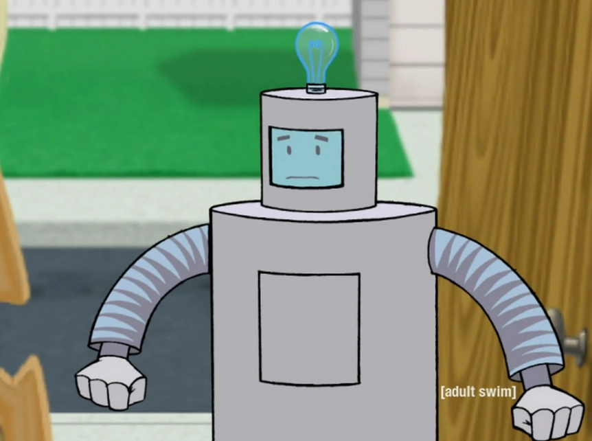

# Rudy

<p align="center">
  
</p>

ROS 2 **Jazzy** workspace for the Rudy upper-body humanoid (RobStride RS03 actuators, CAN bus, Isaac Lab sim-to-real).

## Layout

- `src/description` — URDF / xacro robot model (kinematic source of truth)
- `src/bringup` — XML launch files and runtime parameters
- `src/msgs` — Custom message / service / action definitions (placeholder for now)
- `src/driver` — **Rust** CAN driver + protocol (`driver_node`)
- `src/control` — `ros2_control` hardware plugin(s) + controller YAML (starts with a loopback `SystemInterface`)
- `src/telemetry` — diagnostics + rosbag launch helpers
- `src/simulation` — Isaac Lab scaffold + sim YAML configs
- `src/tests` — `launch_testing` + parity tests
- `config/` — Workspace-wide configuration (actuator specs, etc.)
- `deploy/pi5/` — Raspberry Pi 5 bring-up + deploy scripts
- `.devcontainer/` — Desktop dev container (ROS Jazzy + Rust + cross tools)
- [`docs/`](docs/README.md) — Architecture, runbooks, robotics reference, research exports, MCP stack

## Prerequisites

- **Desktop**: ROS 2 **Jazzy** (`desktop` or `desktop-full`), `colcon`, Rust (`cargo`, `rustfmt`, `clippy`), plus `xacro` for tests.
- **Pi 5**: Ubuntu **24.04** aarch64 + `ros-jazzy-ros-base` (see `deploy/pi5/`).

## Build

```bash
cd /path/to/robot
source /opt/ros/jazzy/setup.bash
rosdep install --from-paths src --ignore-src -r -y
colcon build --symlink-install
source install/setup.bash
```

## Tests

```bash
# Python parity / gold-standard tests (URDF + actuator spec)
python3 -m pip install -U pytest pyyaml xacro urdfdom-py
python3 -m pytest -q tests

# Rust unit tests (driver)
(cd src/driver && cargo test)

# ROS package tests (after colcon build)
colcon test
colcon test-result --verbose
```

## Visualize the model

```bash
ros2 launch bringup display_model.launch.xml
```

## Validate URDF (without full ROS)

```bash
brew install urdfdom graphviz   # macOS example
python3 -m venv .venv && .venv/bin/pip install xacro urdfdom-py

PATH="$PWD/.venv/bin:$PATH" xacro src/description/urdf/robot.urdf.xacro > /tmp/robot.urdf
check_urdf /tmp/robot.urdf
PATH="$PWD/.venv/bin:$PATH" python3 scripts/validate_urdf.py
```

## CI

GitHub Actions workflow: `.github/workflows/ci.yaml` (Rust + aarch64 `cargo check`, `colcon` build/test, pytest).

## License

Apache-2.0 (see `LICENSE`).
