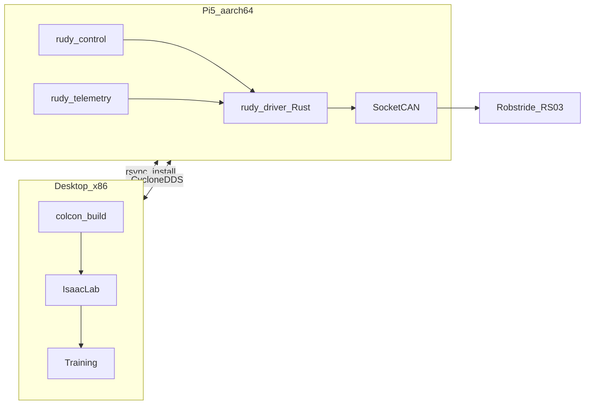

# Rudy architecture

This document is the **living** system architecture for the Rudy monorepo. Update it whenever packages, data flows, or deployment topology change.

## Topology

Rudy uses a **two-machine** layout:

- **Desktop (x86_64 + NVIDIA GPU)**: development, `colcon` builds, Isaac Lab training, RViz, heavy logging.
- **Raspberry Pi 5 (aarch64 + CAN HAT)**: onboard runtime — CAN driver, `ros2_control`, telemetry, policy inference.



## Packages (ROS 2)

| Package | Role |
|---------|------|
| `rudy_description` | URDF / xacro — kinematic source of truth |
| `rudy_bringup` | XML launch + YAML params |
| `rudy_msgs` | Custom messages (placeholder) |
| `rudy_driver` | Rust CAN stack + `rudy_driver_node` (SocketCAN; Linux-only I/O) |
| `rudy_control` | `ros2_control` hardware plugin(s) + controller YAML |
| `rudy_telemetry` | Diagnostics + rosbag launch helpers |
| `rudy_simulation` | Isaac Lab scaffold + sim config YAML |
| `rudy_tests` | `launch_testing` + parity tests |

## Data flow (target)

```mermaid
graph TD
  CM[controller_manager] --> HWI[rudy_control_plugin]
  HWI -->|ROS_topics| RustNode[rudy_driver_node]
  RustNode --> CAN[can0_can1]
  RustNode --> Diag[/diagnostics]
  RustNode --> JS[/joint_states]
```

Today: `rudy_control` ships a **loopback** `SystemInterface` for CI/bring-up. The topic bridge to the Rust driver is the next integration step.

## Configuration hierarchy

- **Actuator truth**: [`config/actuators/robstride_rs03.yaml`](../config/actuators/robstride_rs03.yaml)
- **URDF limits/dynamics**: must stay consistent with the actuator spec (enforced by `tests/`)
- **Sim randomization**: `src/rudy_simulation/configs/*.yaml`
- **ROS parameters**: per-package `config/` + `rudy_bringup`

## See also

- [Runbook: Pi 5](runbooks/pi5.md)
- [Runbook: Isaac Lab](runbooks/isaac_lab.md)
- [Decisions (ADR)](decisions/)
