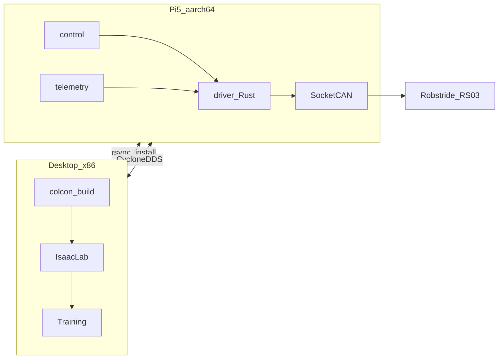

# Rudy architecture

This document is the **living** system architecture for the Rudy monorepo. Update it whenever packages, data flows, or deployment topology change.

## Topology

Rudy uses a **two-machine** layout:

- **Desktop (x86_64 + NVIDIA GPU)**: development, `colcon` builds, Isaac Lab training, RViz, heavy logging.
- **Raspberry Pi 5 (aarch64 + CAN HAT)**: onboard runtime — CAN driver, `ros2_control`, telemetry, policy inference.




## Top-level layout

The monorepo splits along toolchain boundaries. Every top-level folder names a
distinct concern; no single folder dominates.


| Directory  | Toolchain            | Role                                              |
| ---------- | -------------------- | ------------------------------------------------- |
| `ros/src/` | colcon / ament_cmake | ROS 2 Jazzy packages (see table below)            |
| `crates/`  | Cargo workspace      | Non-ROS Rust — currently `rudydae` daemon           |
| `link/`    | npm / Vite           | React + TypeScript operator-console UI            |
| `config/`  | YAML / TOML          | Actuator specs, `rudyd.toml`, inventory           |
| `deploy/`  | shell / systemd      | Pi 5 bring-up, systemd units, Tailscale           |
| `docs/`    | markdown             | Architecture, ADRs, runbooks, research            |
| `tools/`   | Python               | RobStride bench scripts, Motor Studio exports     |
| `scripts/` | Python               | Repo-level helpers (URDF validation, etc.)        |
| `tests/`   | pytest               | Cross-cutting parity tests (URDF ↔ actuator spec) |


## Packages (ROS 2, in `ros/src/`)


| Package       | Role                                                                                                                                  |
| ------------- | ------------------------------------------------------------------------------------------------------------------------------------- |
| `description` | URDF / xacro — kinematic source of truth                                                                                              |
| `bringup`     | XML launch + YAML params                                                                                                              |
| `msgs`        | Custom messages (placeholder)                                                                                                         |
| `driver`      | Rust CAN stack + `driver_node` (SocketCAN; Linux-only I/O). Hybrid ament_cmake + Cargo package — see ADR-0004 for the deferred split. |
| `control`     | `ros2_control` hardware plugin(s) + controller YAML                                                                                   |
| `telemetry`   | Diagnostics + rosbag launch helpers                                                                                                   |
| `simulation`  | Isaac Lab scaffold + sim config YAML                                                                                                  |
| `tests`       | `launch_testing` + parity tests                                                                                                       |


## Operator console (`rudydae` + `link`)

Separate from the ROS 2 runtime. `rudydae` (in `crates/rudydae/`) owns the CAN bus
directly and exposes two network surfaces: HTTPS CRUD (axum) for parameter
editing + commands, and WebTransport over HTTP/3 (wtransport) for the
telemetry firehose. The `link` SPA (in `link/`) consumes both. Tailscale-only
reachable. See [ADR-0004](decisions/0004-operator-console.md).

When the ROS 2 `driver_node` is eventually written, it will be a sibling
consumer of the same `rudydae` CAN handle — not a competitor. This is why
`rudydae` is the long-lived process and not `driver_node`.

## Data flow (target)

```mermaid
graph TD
  CM[controller_manager] --> HWI[control_plugin]
  HWI -->|ROS_topics| RustNode[driver_node]
  RustNode --> CAN[can0_can1]
  RustNode --> Diag[/diagnostics]
  RustNode --> JS[/joint_states]
```


Today: `control` ships a **loopback** `SystemInterface` for CI/bring-up. The topic bridge to the Rust driver is the next integration step.

## Configuration hierarchy

- **Actuator truth**: `[config/actuators/robstride_rs03.yaml](../config/actuators/robstride_rs03.yaml)`
- **URDF limits/dynamics**: must stay consistent with the actuator spec (enforced by `tests/`)
- **Sim randomization**: `ros/src/simulation/configs/*.yaml`
- **ROS parameters**: per-package `config/` + `bringup`

## See also

- [Runbook: Pi 5](runbooks/pi5.md)
- [Runbook: Isaac Lab](runbooks/isaac_lab.md)
- [Decisions (ADR)](decisions/)

